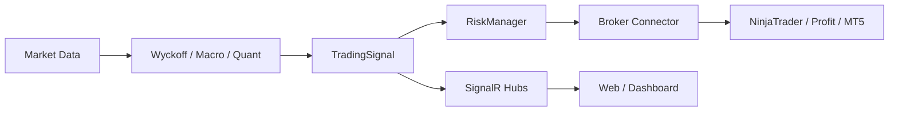

# Visão geral da arquitetura

## Objetivo

Plataforma SaaS multi-tenant para trading automatizado: análise (Wyckoff, macro, quant), execução via brokers (ProfitChart, NinjaTrader, MT5), billing Stripe e UI Blazor.

## Stack

| Camada | Tecnologia |
|--------|------------|
| Runtime | .NET 9 |
| API | ASP.NET Core MVC + SignalR |
| UI | Blazor Interactive Server (`NtBot.Web`) |
| UI legado | React + Vite (`ntbot-dashboard`) |
| ORM | Entity Framework Core 9 + Npgsql |
| DB | PostgreSQL 16 (`ntquant`) |
| Cache | Redis (planejado) |
| Pagamentos | Stripe (Fase 5) |
| Deploy | Docker + Coolify |

## Camadas (Clean Architecture)

```
┌─────────────────────────────────────────────────────────┐
│  NtBot.Web (Blazor)          ntbot-dashboard (React)    │
└────────────────────────┬────────────────────────────────┘
                         │ HTTP / SignalR
┌────────────────────────▼────────────────────────────────┐
│  NtBot.Api — Controllers, Hubs, Services (host fino)    │
└────────────────────────┬────────────────────────────────┘
                         │
┌────────────────────────▼────────────────────────────────┐
│  NtBot.Application — MediatR, validators, use cases     │
└────────────────────────┬────────────────────────────────┘
                         │
┌────────────────────────▼────────────────────────────────┐
│  NtBot.Infrastructure — DbContext, repos, migrations    │
└────────────────────────┬────────────────────────────────┘
                         │
┌────────────────────────▼────────────────────────────────┐
│  NtBot.Domain — Entidades, enums, regras puras          │
└─────────────────────────────────────────────────────────┘

Módulos futuros (stubs): Identity, Billing, MarketData,
Trading, Notifications, Analytics, Worker
```

## Fluxo de trading (simplificado)



## Princípios para novas implementações

1. **Entidades** → `NtBot.Domain/Entities/`
2. **Regras de negócio / commands** → `NtBot.Application/`
3. **Persistência** → `NtBot.Infrastructure/Persistence/`
4. **HTTP/SignalR** → `NtBot.Api/` (controllers finos; delegar ao MediatR quando possível)
5. **Auth/Billing** → extrair para `NtBot.Identity` / `NtBot.Billing` (não duplicar na Api)

## Referência de padrões

O projeto [BarberAI](C:\Projetos\barberai) usa a mesma stack (MVC + Blazor + Stripe + PostgreSQL Coolify). Reutilize padrões de:

- Cookie auth + OTP
- `StripeService` / webhooks idempotentes
- `appsettings.Development` / `Production` com mesmo host Postgres
