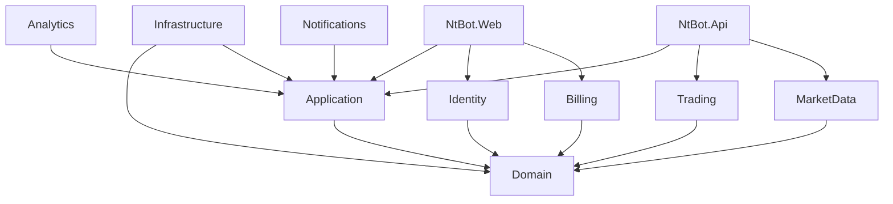
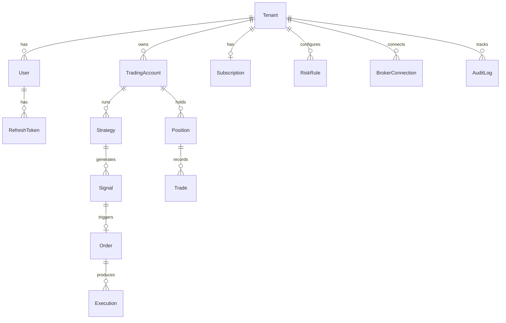

# NTBot — Proposta de Arquitetura Enterprise

**Data:** 20 de junho de 2026  
**Target:** .NET 9, ASP.NET Core MVC + Blazor Interactive Components  
**Capacidade:** Milhares de usuários simultâneos

---

## 1. Princípios Arquiteturais

| Princípio | Aplicação |
|-----------|-----------|
| **Clean Architecture** | Dependências apontam para dentro (Domain no centro) |
| **DDD** | Aggregates: Tenant, TradingAccount, Strategy, Subscription |
| **CQRS** | Commands/Queries via MediatR — leitura otimizada, escrita validada |
| **Event-Driven** | Domain events → outbox → handlers (signals, trades, billing) |
| **Multi-Tenancy** | Shared database, shared schema, `TenantId` em todas as entidades |
| **Plugin Architecture** | `IBrokerConnector`, `IMarketDataProvider` desacoplados |
| **SSR + Interactive** | MVC para SEO/landing; Blazor Server/WebAssembly hybrid para dashboards |

---

## 2. Estrutura de Solução Proposta

```
ntbot/
├── src/
│   ├── NtBot.Web/                 # MVC + Blazor Interactive (host principal)
│   ├── NtBot.Api/                 # Minimal APIs + SignalR (backend realtime)
│   ├── NtBot.Application/         # CQRS handlers, validators, DTOs
│   ├── NtBot.Domain/              # Entities, aggregates, domain events
│   ├── NtBot.Infrastructure/      # EF Core, Redis, external APIs
│   ├── NtBot.Shared/              # Constants, extensions, shared DTOs
│   ├── NtBot.Identity/            # Auth, roles, MFA, JWT
│   ├── NtBot.Billing/             # Stripe, plans, webhooks
│   ├── NtBot.MarketData/          # Providers (TradingView, Yahoo, Polygon)
│   ├── NtBot.Trading/             # Engines, strategies, broker connectors
│   ├── NtBot.Admin/               # Admin area (pode ser part of Web)
│   ├── NtBot.Notifications/       # Email, push, in-app
│   └── NtBot.Analytics/           # IA prep (OpenAI, Claude, Ollama)
├── tests/
│   ├── NtBot.UnitTests/
│   ├── NtBot.IntegrationTests/
│   └── NtBot.E2ETests/
├── docs/
├── deploy/
├── docker/
└── scripts/
```

### 2.1 Dependências entre Projetos



---

## 3. NtBot.Web — Frontend Unificado

### 3.1 Por que MVC + Blazor Interactive (não Blazor Server puro)

| Requisito | Solução |
|-----------|---------|
| SEO landing pages | Razor Pages / MVC Views estáticas |
| Dashboards realtime | Blazor Interactive Server/WebAssembly |
| Menor memória vs Blazor Server full | Componentes interativos sob demanda |
| SignalR nativo | Shared hub connection no circuit |
| Indexação Google | SSR para `/`, `/pricing`, `/docs` |

### 3.2 Render Modes (.NET 9)

```csharp
// Program.cs — NtBot.Web
builder.Services.AddRazorComponents()
    .AddInteractiveServerComponents()
    .AddInteractiveWebAssemblyComponents(); // opcional para widgets pesados

app.MapRazorComponents<App>()
    .AddInteractiveServerRenderMode()
    .AddInteractiveWebAssemblyRenderMode();
```

| Área | Render Mode | Exemplo |
|------|-------------|---------|
| Landing, Pricing, Blog | Static SSR | `/`, `/pricing` |
| Login, Register | Static SSR + form POST | `/account/login` |
| Dashboard, Charts | Interactive Server | `/app/dashboard` |
| Trading Panel | Interactive Server + SignalR | `/app/scalping` |
| Admin | Interactive Server | `/admin/tenants` |

### 3.3 Estrutura NtBot.Web

```
NtBot.Web/
├── Areas/
│   ├── App/                    # Área autenticada (dashboard)
│   ├── Admin/                  # Administração
│   └── Account/                # Login, registro, billing portal
├── Components/                 # Design System Blazor
│   ├── Layout/
│   │   ├── Sidebar.razor
│   │   ├── Navbar.razor
│   │   └── MarketTicker.razor
│   ├── Trading/
│   │   ├── SignalCard.razor
│   │   ├── PositionGrid.razor
│   │   ├── TradeGrid.razor
│   │   ├── PnLCard.razor
│   │   ├── OrderBook.razor
│   │   ├── TradingPanel.razor
│   │   └── RiskCard.razor
│   ├── Charts/
│   │   ├── PerformanceChart.razor
│   │   └── HeatMap.razor
│   └── Shared/
│       ├── MetricCard.razor
│       ├── BrokerStatus.razor
│       └── NotificationCenter.razor
├── Pages/                      # Razor Pages públicas
├── wwwroot/
│   ├── css/design-system.css
│   └── js/tradingview/         # Widget wrapper
└── Services/
    ├── SignalRClientService.cs
    └── TradingViewWidgetService.cs
```

### 3.4 Design System — Dark Theme Premium

Inspirado em TradingView / Binance / QuantConnect:

```css
:root {
  --nt-bg-primary: #0b0e11;
  --nt-bg-secondary: #1e2329;
  --nt-bg-elevated: #2b3139;
  --nt-border: #363c45;
  --nt-text-primary: #eaecef;
  --nt-text-secondary: #848e9c;
  --nt-accent: #f0b90b;          /* Binance gold */
  --nt-accent-blue: #2962ff;     /* TradingView blue */
  --nt-success: #0ecb81;
  --nt-danger: #f6465d;
  --nt-warning: #f0b90b;
  --nt-font: 'Inter', 'Segoe UI', system-ui;
  --nt-font-mono: 'JetBrains Mono', 'Consolas', monospace;
}
```

Componentes Blazor usam CSS isolation (`.razor.css`) + tokens globais.

---

## 4. NtBot.Api — Backend Realtime

### 4.1 Responsabilidades

- Minimal APIs para mobile/integrações externas
- SignalR hubs (market, trading, risk, notifications)
- Webhooks (Stripe, brokers)
- Health checks, metrics endpoints
- **Não** servir views (delegado ao NtBot.Web)

### 4.2 SignalR Hub Architecture

```
                    ┌─────────────────┐
                    │   NtBot.Web     │
                    │ (Blazor Client) │
                    └────────┬────────┘
                             │ WebSocket
                    ┌────────▼────────┐
                    │   NtBot.Api     │
                    │  SignalR Hubs   │
                    └────────┬────────┘
           ┌─────────────────┼─────────────────┐
           ▼                 ▼                 ▼
    MarketDataHub     TradingHub         NotificationHub
           │                 │                 │
           ▼                 ▼                 ▼
   IMarketDataProvider  IBrokerConnector   INotificationService
```

**Autenticação SignalR:** JWT via query string `?access_token=` ou cookie forwarded.

### 4.3 Minimal API Examples

```csharp
// Market data
app.MapGet("/api/v1/quotes/{symbol}", GetQuote).RequireAuthorization();
app.MapGet("/api/v1/candles/{symbol}", GetCandles).RequireAuthorization();

// Trading
app.MapPost("/api/v1/orders", PlaceOrder).RequireAuthorization();
app.MapGet("/api/v1/positions", GetPositions).RequireAuthorization();

// Webhooks (no auth — signature validation)
app.MapPost("/api/webhooks/stripe", StripeWebhook);
```

---

## 5. NtBot.Application — CQRS Layer

### 5.1 Estrutura

```
NtBot.Application/
├── Commands/
│   ├── Trading/
│   │   ├── PlaceOrderCommand.cs
│   │   └── CreateGridCommand.cs
│   ├── Billing/
│   │   └── CreateCheckoutSessionCommand.cs
│   └── Identity/
│       └── RegisterUserCommand.cs
├── Queries/
│   ├── GetDashboardStatsQuery.cs
│   ├── GetWyckoffAnalysisQuery.cs
│   └── GetSignalsQuery.cs
├── Handlers/
├── Validators/          # FluentValidation
├── Mappings/            # AutoMapper profiles
├── Behaviors/
│   ├── ValidationBehavior.cs
│   ├── LoggingBehavior.cs
│   └── TenantBehavior.cs    # Injeta TenantId
└── Interfaces/
```

### 5.2 MediatR Pipeline

```
Request → TenantBehavior → ValidationBehavior → LoggingBehavior → Handler → Response
                ↓
         Reject if tenant inactive / over limits
```

---

## 6. NtBot.Domain — Modelo de Domínio

### 6.1 Aggregates Principais



### 6.2 Domain Events

| Evento | Handlers |
|--------|----------|
| `SignalGenerated` | NotifyHub, PersistSignal, CheckRisk |
| `OrderFilled` | UpdatePosition, NotifyUser, AuditLog |
| `SubscriptionChanged` | UpdateTenantLimits, SendEmail |
| `RiskLimitBreached` | BlockTrading, AlertAdmin |

---

## 7. NtBot.Identity

Portar e adaptar de BarberAI:

| Feature | Implementação |
|---------|---------------|
| Login/Register | MVC Views + IdentityUser custom |
| JWT + Refresh Token | Para API/SignalR/Blazor WASM |
| Cookie Auth | Para SSR pages |
| MFA | TOTP (Google Authenticator) |
| Email Confirmation | SMTP service |
| Forgot Password | OTP via email (OtpVerificationService) |
| Roles | Admin, Support, Free, Starter, Pro, Enterprise |

```csharp
public static class NtBotRoles
{
    public const string Admin = "Admin";
    public const string Support = "Support";
    public const string Free = "Free";
    public const string Starter = "Starter";
    public const string Pro = "Pro";
    public const string Enterprise = "Enterprise";
}
```

**Policy-based authorization:**
- `[Authorize(Policy = "ProPlan")]` — verifica subscription tier
- `[Authorize(Policy = "TenantAdmin")]` — admin do tenant

---

## 8. NtBot.Billing — Stripe

Portar de `BarberAI.Application/Services/StripeService.cs`:

| Feature | Stripe API |
|---------|------------|
| Plans | Products + Prices |
| Checkout | Checkout Sessions |
| Subscriptions | Subscriptions API |
| Customer Portal | Billing Portal Sessions |
| Webhooks | `checkout.session.completed`, `invoice.paid`, `customer.subscription.updated` |
| Trial | `trial_period_days` |
| Coupons | Promotion Codes |
| Affiliates | Stripe Connect (fase posterior) |

### Planos NTBot

| Plano | Preço sugerido | Limites |
|-------|----------------|---------|
| Free | $0 | 1 strategy, paper trading, delayed data |
| Starter | $29/mo | 3 strategies, 1 broker, realtime B3 |
| Trader Pro | $99/mo | 10 strategies, all brokers, TradingView |
| Funded Trader | $199/mo | Unlimited strategies, priority execution |
| Institutional | Custom | API access, dedicated support, SLA |

---

## 9. NtBot.MarketData

### 9.1 Provider Abstraction

```csharp
public interface IMarketDataProvider
{
    string ProviderName { get; }
    Task<Quote> GetQuoteAsync(string symbol, CancellationToken ct);
    Task<IReadOnlyList<Candle>> GetCandlesAsync(string symbol, string timeframe, int count, CancellationToken ct);
    IAsyncEnumerable<Tick> StreamTicksAsync(string symbol, CancellationToken ct);
    Task<IReadOnlyList<string>> SearchSymbolsAsync(string query, CancellationToken ct);
    bool SupportsMarket(Market market);
}

public enum Market { B3, NYSE, NASDAQ, CME, FOREX, CRYPTO }
```

### 9.2 Implementações

| Provider | Mercados | Prioridade |
|----------|----------|------------|
| `TradingViewProvider` | Global (widget + UDF) | P0 |
| `ProfitChartProvider` | B3 | P0 — reutilizar ProfitService |
| `YahooFinanceProvider` | US equities, forex | P1 |
| `PolygonProvider` | US stocks, options | P2 |
| `MockProvider` | Dev/test | P0 |

### 9.3 TradingView Integration

```
NtBot.Web/wwwroot/js/tradingview/
├── tv-widget.js              # Wrapper custom
├── advanced-chart.js
├── market-overview.js
├── heatmap.js
├── screener.js
└── economic-calendar.js
```

Blazor JS interop para inicializar widgets com dark theme.

### 9.4 Cache Layer (Redis)

```
Key patterns:
  quote:{symbol}           TTL 1s
  candles:{symbol}:{tf}    TTL 60s
  watchlist:{tenantId}     TTL 300s
  gex:{symbol}             TTL 300s
```

---

## 10. NtBot.Trading

### 10.1 Broker Connector Plugin System

```csharp
public interface IBrokerConnector
{
    string BrokerId { get; }
    Task ConnectAsync(BrokerCredentials credentials, CancellationToken ct);
    Task<OrderResult> PlaceOrderAsync(OrderRequest order, CancellationToken ct);
    Task<IReadOnlyList<Position>> GetPositionsAsync(CancellationToken ct);
    Task<AccountInfo> GetAccountInfoAsync(CancellationToken ct);
    IAsyncEnumerable<BrokerEvent> SubscribeEventsAsync(CancellationToken ct);
}
```

| Connector | Source | Platform |
|-----------|--------|----------|
| `ProfitChartConnector` | NTBot.Api/Services/Profit | Windows/B3 |
| `MetaTraderConnector` | MT5/ + MT5Controller | Cross-platform |
| `NinjaTraderConnector` | NinjaTraderService | Windows |
| `InteractiveBrokersConnector` | Novo | TWS API |
| `PaperTradingConnector` | Novo | Dev/demo |

### 10.2 Automation Engine

```
IAutomationStrategy
├── ScalpingStrategy
├── GridStrategy          ← GridEngine existente
├── BreakoutStrategy
├── TrendFollowingStrategy
├── MeanReversionStrategy
├── WyckoffStrategy       ← WyckoffService
├── SmartMoneyStrategy
└── CustomStrategyPlugin  ← user-defined (JSON/script)
```

**Orchestrator:** `TradingOrchestrator` BackgroundService — processa por tenant → account → strategy.

---

## 11. NtBot.Analytics (IA — Fase Futura)

```csharp
public interface IAnalyticsProvider
{
    Task<MarketSummary> SummarizeMarketAsync(string symbol);
    Task<TechnicalAnalysis> AnalyzeTechnicalsAsync(string symbol, string timeframe);
    Task<string> ExplainSignalAsync(Signal signal);
}

// Implementações: OpenAI, Claude, Gemini, Ollama, OpenRouter
// Padrão: Strategy pattern + API key per tenant (encrypted)
```

Preparar interfaces e `AnalyticsRequest/Response` DTOs na Fase 2; implementação na Fase 10+.

---

## 12. Multi-Tenancy

### 12.1 Estratégia: Shared Database, Shared Schema

```csharp
public interface ITenantEntity
{
    Guid TenantId { get; set; }
}

// EF Global Query Filter
modelBuilder.Entity<T>().HasQueryFilter(e => e.TenantId == _tenantContext.TenantId);
```

### 12.2 Tenant Resolution

1. JWT claim `tenant_id`
2. Cookie `NtBot.TenantId` (SSR)
3. Subdomain `{tenant}.ntbot.io` (futuro)

### 12.3 Isolamento

| Recurso | Isolamento |
|---------|------------|
| Trading Accounts | TenantId FK |
| Strategies | TenantId FK |
| Signals/Trades | TenantId FK |
| Configurations | TenantId FK |
| Audit Logs | TenantId FK + immutable |
| Redis keys | Prefix `{tenantId}:` |
| SignalR groups | `tenant_{tenantId}` |

---

## 13. Observabilidade

```
┌─────────────┐     ┌──────────────┐     ┌─────────────┐
│  NtBot.Web  │────▶│ OpenTelemetry│────▶│ Prometheus  │
│  NtBot.Api  │     │   Collector  │     └──────┬──────┘
└─────────────┘     └──────┬───────┘            │
                           │              ┌─────▼─────┐
                           ▼              │  Grafana  │
                      ┌─────────┐        └───────────┘
                      │  Loki   │
                      └─────────┘
                           │
                      ┌─────▼─────┐
                      │    Seq    │  (structured logs dev)
                      └───────────┘
```

**Instrumentação:**
- ASP.NET Core, HttpClient, EF Core, SignalR, Redis
- Custom metrics: `ntbot_signals_total`, `ntbot_orders_latency`, `ntbot_active_tenants`
- Health checks: `/health`, `/health/ready`, `/health/live`

---

## 14. Segurança

| Controle | Implementação |
|----------|---------------|
| OWASP Top 10 | Input validation, output encoding, CSP headers |
| Rate Limiting | AspNetCore.RateLimiting + Redis |
| CSRF | Antiforgery tokens (MVC forms) |
| XSS | Razor encoding + CSP |
| Secrets | Environment variables / Coolify secrets |
| Audit Trail | AuditLogs table + domain events |
| Encryption | DataProtection keys in PostgreSQL |
| MFA | TOTP |
| API Keys | Para integrações broker (encrypted at rest) |

---

## 15. Escalabilidade Horizontal

```
                    ┌──────────────┐
                    │   Traefik    │
                    │  (Coolify)   │
                    └──────┬───────┘
           ┌───────────────┼───────────────┐
           ▼               ▼               ▼
    ┌────────────┐  ┌────────────┐  ┌────────────┐
    │ NtBot.Web  │  │ NtBot.Web  │  │ NtBot.Web  │
    │  (pod 1)   │  │  (pod 2)   │  │  (pod N)   │
    └──────┬─────┘  └──────┬─────┘  └──────┬─────┘
           └───────────────┼───────────────┘
                           ▼
              ┌────────────────────────┐
              │     Redis Backplane    │  ← SignalR scale-out
              └────────────┬───────────┘
                           ▼
              ┌────────────────────────┐
              │   PostgreSQL (primary) │
              └────────────────────────┘
```

**Workers separados:**
- `NtBot.Worker` — TradingOrchestrator, market data sync
- `NtBot.Worker.ProfitChart` — Windows-only RTD bridge

---

## 16. Decisões Arquiteturais (ADRs Resumidos)

| # | Decisão | Alternativa Rejeitada | Motivo |
|---|---------|----------------------|--------|
| ADR-001 | MVC + Blazor Interactive | React SPA | SEO, SSR, memória, integração SignalR |
| ADR-002 | Shared schema multi-tenant | DB per tenant | Custo operacional, migrations |
| ADR-003 | MediatR CQRS | Direct service calls | Testabilidade, cross-cutting |
| ADR-004 | PostgreSQL único | SQL Server | BarberAI já usa, open source, Coolify |
| ADR-005 | Redis cache + SignalR backplane | In-memory only | Escala horizontal |
| ADR-006 | Stripe Billing | MercadoPago | Global, subscriptions, portal |
| ADR-007 | Plugin brokers | Monolítico | Desacoplamento NT/MT5/IB/Profit |
| ADR-008 | TradingView widget | Lightweight Charts only | Feature parity com spec |

---

## 17. Roadmap de Evolução Futura

1. **v1.0** — MVP SaaS (auth, billing, dashboard, ProfitChart, 1 broker)
2. **v1.5** — TradingView full, NinjaTrader, backtesting
3. **v2.0** — IB connector, mobile PWA, affiliate program
4. **v2.5** — NtBot.Analytics IA, custom strategy builder
5. **v3.0** — Marketplace de estratégias, copy trading, institutional API

---

*Documento de referência para implementação — aguarda aprovação implícita para Fase 2.*
