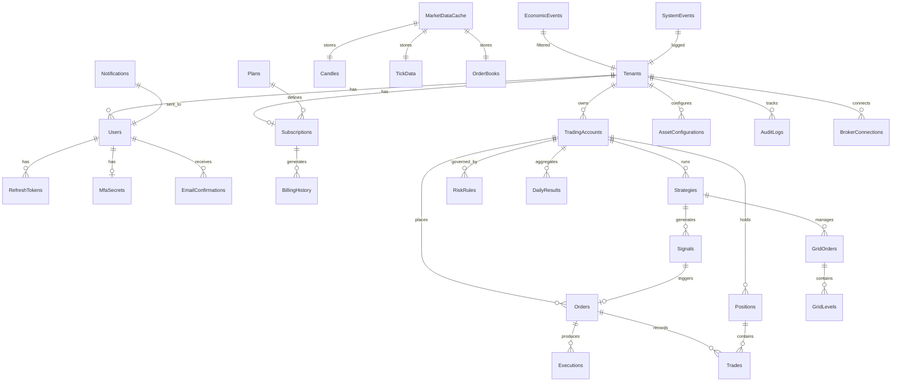

# NTBot — Plano de Banco de Dados PostgreSQL

**Data:** 20 de junho de 2026  
**SGBD:** PostgreSQL 16+  
**ORM:** Entity Framework Core 9 + Npgsql  
**Estratégia Multi-Tenant:** Shared database, shared schema, `TenantId` FK

---

## 1. Visão Geral

Migrar de schema monolítico EF (`NTBotDbContext` com 22 DbSets) para schema enterprise unificado com billing, identity, audit e broker connections — mantendo dados de trading existentes.

### Estado Atual vs. Target

| Aspecto | Atual | Target |
|---------|-------|--------|
| Provider | PostgreSQL (configurado) | PostgreSQL 16 |
| Entidades | 22 DbSets em Models/ | ~35 tabelas normalizadas |
| Domain duplicado | Domain/Entities/ morto | Removido, unificado em NtBot.Domain |
| Tenant isolation | FK apenas | FK + global query filter |
| Billing | Enum SubscriptionPlan | Stripe-synced tables |
| Migrations | 1 (InitialCreate) | Migrations incrementais limpas |
| TimescaleDB | Não | Opcional para candles/ticks |

---

## 2. Diagrama ER — Target Schema



---

## 3. Tabelas — Inventário Completo

### 3.1 Identity & Tenancy

#### `tenants`
| Coluna | Tipo | Notas |
|--------|------|-------|
| id | UUID PK | |
| name | VARCHAR(100) NOT NULL | |
| slug | VARCHAR(50) UNIQUE | Subdomain futuro |
| email | VARCHAR(255) NOT NULL UNIQUE | |
| stripe_customer_id | VARCHAR(100) | Sync Stripe |
| is_active | BOOLEAN DEFAULT true | |
| is_trial | BOOLEAN DEFAULT false | |
| max_active_positions | INT DEFAULT 1 | Por plano |
| max_daily_trades | INT DEFAULT 10 | Por plano |
| max_risk_per_trade | DECIMAL(5,2) | % |
| max_daily_loss | DECIMAL(18,2) | |
| max_drawdown_percent | DECIMAL(5,2) | |
| settings | JSONB | Config flexível |
| created_at | TIMESTAMPTZ | |
| updated_at | TIMESTAMPTZ | |

**Origem:** `Models/Tenant.cs` — expandir com `stripe_customer_id`, `slug`, `settings` JSONB.

#### `users`
| Coluna | Tipo | Notas |
|--------|------|-------|
| id | UUID PK | |
| tenant_id | UUID FK → tenants | |
| email | VARCHAR(255) NOT NULL | UNIQUE per tenant |
| password_hash | VARCHAR(255) | BCrypt |
| full_name | VARCHAR(200) | |
| role | VARCHAR(50) | Admin/Support/Free/Starter/Pro/Enterprise |
| is_active | BOOLEAN | |
| email_confirmed | BOOLEAN DEFAULT false | |
| mfa_enabled | BOOLEAN DEFAULT false | |
| last_login | TIMESTAMPTZ | |
| created_at | TIMESTAMPTZ | |

**Índice:** `UNIQUE(tenant_id, email)`

#### `refresh_tokens`
| Coluna | Tipo | Notas |
|--------|------|-------|
| id | UUID PK | |
| user_id | UUID FK → users | |
| token | VARCHAR(500) | Hashed |
| expires_at | TIMESTAMPTZ | |
| created_at | TIMESTAMPTZ | |
| revoked_at | TIMESTAMPTZ NULL | |

**Origem:** Novo — portar pattern de JWT refresh.

#### `mfa_secrets`
| Coluna | Tipo | Notas |
|--------|------|-------|
| id | UUID PK | |
| user_id | UUID FK → users UNIQUE | |
| secret_key | VARCHAR(100) | Encrypted TOTP secret |
| is_verified | BOOLEAN | |
| created_at | TIMESTAMPTZ | |

#### `email_confirmations`
| Coluna | Tipo | Notas |
|--------|------|-------|
| id | UUID PK | |
| user_id | UUID FK | |
| token | VARCHAR(200) | |
| expires_at | TIMESTAMPTZ | |
| confirmed_at | TIMESTAMPTZ NULL | |

#### `otp_verifications`
| Coluna | Tipo | Notas |
|--------|------|-------|
| id | UUID PK | |
| user_id | UUID FK NULL | |
| email | VARCHAR(255) | |
| code | VARCHAR(10) | |
| type | VARCHAR(50) | ForgotPassword, MfaSetup |
| expires_at | TIMESTAMPTZ | |
| used_at | TIMESTAMPTZ NULL | |

**Origem:** Portar de BarberAI `OtpVerificationService`.

---

### 3.2 Billing (Stripe)

#### `plans`
| Coluna | Tipo | Notas |
|--------|------|-------|
| id | UUID PK | |
| name | VARCHAR(100) | Free, Starter, Trader Pro, etc. |
| slug | VARCHAR(50) UNIQUE | |
| stripe_price_id | VARCHAR(100) | |
| stripe_product_id | VARCHAR(100) | |
| price_monthly | DECIMAL(10,2) | |
| price_yearly | DECIMAL(10,2) NULL | |
| currency | VARCHAR(3) DEFAULT 'USD' | |
| max_strategies | INT | |
| max_brokers | INT | |
| max_trading_accounts | INT | |
| features | JSONB | Feature flags |
| is_active | BOOLEAN | |
| sort_order | INT | |

#### `subscriptions`
| Coluna | Tipo | Notas |
|--------|------|-------|
| id | UUID PK | |
| tenant_id | UUID FK → tenants UNIQUE | |
| plan_id | UUID FK → plans | |
| stripe_subscription_id | VARCHAR(100) | |
| stripe_customer_id | VARCHAR(100) | |
| stripe_checkout_session_id | VARCHAR(100) NULL | |
| status | VARCHAR(50) | active, trialing, past_due, canceled |
| payment_status | VARCHAR(50) | |
| current_period_start | TIMESTAMPTZ | |
| current_period_end | TIMESTAMPTZ | |
| trial_end | TIMESTAMPTZ NULL | |
| canceled_at | TIMESTAMPTZ NULL | |
| created_at | TIMESTAMPTZ | |
| updated_at | TIMESTAMPTZ | |

**Origem:** Portar de BarberAI `Subscription.cs` + campos Stripe.

#### `billing_history`
| Coluna | Tipo | Notas |
|--------|------|-------|
| id | UUID PK | |
| tenant_id | UUID FK | |
| subscription_id | UUID FK | |
| stripe_invoice_id | VARCHAR(100) | |
| amount | DECIMAL(10,2) | |
| currency | VARCHAR(3) | |
| status | VARCHAR(50) | paid, open, void |
| paid_at | TIMESTAMPTZ NULL | |
| invoice_url | VARCHAR(500) | |
| created_at | TIMESTAMPTZ | |

#### `webhook_events`
| Coluna | Tipo | Notas |
|--------|------|-------|
| id | UUID PK | |
| stripe_event_id | VARCHAR(100) UNIQUE | Idempotency |
| event_type | VARCHAR(100) | |
| payload | JSONB | |
| processed_at | TIMESTAMPTZ NULL | |
| error | TEXT NULL | |
| created_at | TIMESTAMPTZ | |

**Origem:** BarberAI `WebhookEvent.cs`.

#### `coupons` (Fase posterior)
| Coluna | Tipo |
|--------|------|
| id | UUID PK |
| stripe_coupon_id | VARCHAR(100) |
| code | VARCHAR(50) UNIQUE |
| discount_percent | DECIMAL(5,2) NULL |
| discount_amount | DECIMAL(10,2) NULL |
| max_redemptions | INT NULL |
| expires_at | TIMESTAMPTZ NULL |

---

### 3.3 Trading Core

#### `trading_accounts`
| Coluna | Tipo | Notas |
|--------|------|-------|
| id | UUID PK | |
| tenant_id | UUID FK | |
| broker_connection_id | UUID FK NULL | |
| name | VARCHAR(100) | "Conta Principal" |
| broker | VARCHAR(20) | PROFITCHART, NT, MT5, IB |
| account_number | VARCHAR(50) | |
| account_currency | VARCHAR(10) | |
| balance | DECIMAL(18,2) | |
| equity | DECIMAL(18,2) | |
| is_paper | BOOLEAN DEFAULT false | |
| is_active | BOOLEAN | |
| created_at | TIMESTAMPTZ | |

**Origem:** Evoluir `AccountInfo` + `TradingSession`.

#### `broker_connections`
| Coluna | Tipo | Notas |
|--------|------|-------|
| id | UUID PK | |
| tenant_id | UUID FK | |
| broker_type | VARCHAR(20) | |
| display_name | VARCHAR(100) | |
| credentials_encrypted | TEXT | AES encrypted JSON |
| is_connected | BOOLEAN | |
| last_heartbeat | TIMESTAMPTZ | |
| settings | JSONB | |
| created_at | TIMESTAMPTZ | |

#### `strategies`
| Coluna | Tipo | Notas |
|--------|------|-------|
| id | UUID PK | |
| tenant_id | UUID FK | |
| trading_account_id | UUID FK | |
| name | VARCHAR(100) | |
| type | VARCHAR(50) | Scalping, Grid, Wyckoff, Quant, Custom |
| symbol | VARCHAR(20) | |
| parameters | JSONB | Strategy config |
| is_active | BOOLEAN | |
| created_at | TIMESTAMPTZ | |

#### `signals`
| Coluna | Tipo | Notas |
|--------|------|-------|
| id | UUID PK | |
| tenant_id | UUID FK | |
| strategy_id | UUID FK NULL | |
| symbol | VARCHAR(20) | |
| direction | VARCHAR(10) | LONG, SHORT |
| confidence_score | DECIMAL(5,2) | |
| wyckoff_phase | VARCHAR(50) NULL | |
| wyckoff_event | VARCHAR(50) NULL | |
| macro_bias | VARCHAR(20) NULL | |
| news_impact | DECIMAL(5,2) NULL | |
| entry_price | DECIMAL(18,8) | |
| stop_loss | DECIMAL(18,8) | |
| take_profit | DECIMAL(18,8) | |
| risk_reward_ratio | DECIMAL(5,2) | |
| status | VARCHAR(20) | PENDING, EXECUTED, CANCELLED |
| created_at | TIMESTAMPTZ | |
| executed_at | TIMESTAMPTZ NULL | |

**Origem:** `Models/TradingSignal.cs` + `Models/StrategySignal.cs` (consolidar).

#### `orders`
| Coluna | Tipo | Notas |
|--------|------|-------|
| id | UUID PK | |
| tenant_id | UUID FK | |
| trading_account_id | UUID FK | |
| signal_id | UUID FK NULL | |
| broker_order_id | VARCHAR(100) | |
| symbol | VARCHAR(20) | |
| side | VARCHAR(10) | BUY, SELL |
| type | VARCHAR(20) | MARKET, LIMIT, STOP |
| quantity | DECIMAL(18,8) | |
| price | DECIMAL(18,8) NULL | |
| stop_loss | DECIMAL(18,8) NULL | |
| take_profit | DECIMAL(18,8) NULL | |
| status | VARCHAR(20) | PENDING, FILLED, CANCELLED |
| created_at | TIMESTAMPTZ | |
| filled_at | TIMESTAMPTZ NULL | |

#### `executions`
| Coluna | Tipo | Notas |
|--------|------|-------|
| id | UUID PK | |
| tenant_id | UUID FK | |
| order_id | UUID FK | |
| broker_execution_id | VARCHAR(100) | |
| price | DECIMAL(18,8) | |
| quantity | DECIMAL(18,8) | |
| commission | DECIMAL(18,2) | |
| executed_at | TIMESTAMPTZ | |

**Origem:** `Models/TradeExecution.cs`.

#### `positions`
| Coluna | Tipo | Notas |
|--------|------|-------|
| id | UUID PK | |
| tenant_id | UUID FK | |
| trading_account_id | UUID FK | |
| symbol | VARCHAR(20) | |
| side | VARCHAR(10) | LONG, SHORT |
| volume | DECIMAL(18,8) | |
| open_price | DECIMAL(18,8) | |
| current_price | DECIMAL(18,8) NULL | |
| stop_loss | DECIMAL(18,8) NULL | |
| take_profit | DECIMAL(18,8) NULL | |
| unrealized_pnl | DECIMAL(18,2) | |
| swap | DECIMAL(18,2) | |
| commission | DECIMAL(18,2) | |
| status | VARCHAR(20) | OPEN, CLOSED |
| opened_at | TIMESTAMPTZ | |
| closed_at | TIMESTAMPTZ NULL | |

**Origem:** Consolidar `Models/TradePosition.cs` + `Models/Position.cs`.

#### `trades`
| Coluna | Tipo | Notas |
|--------|------|-------|
| id | UUID PK | |
| tenant_id | UUID FK | |
| position_id | UUID FK NULL | |
| signal_id | UUID FK NULL | |
| symbol | VARCHAR(20) | |
| direction | VARCHAR(10) | |
| entry_price | DECIMAL(18,8) | |
| exit_price | DECIMAL(18,8) NULL | |
| quantity | DECIMAL(18,8) | |
| pnl | DECIMAL(18,2) | |
| pnl_percent | DECIMAL(5,2) | |
| commission | DECIMAL(18,2) | |
| net_pnl | DECIMAL(18,2) | |
| mae | DECIMAL(18,8) NULL | |
| mfe | DECIMAL(18,8) NULL | |
| entry_time | TIMESTAMPTZ | |
| exit_time | TIMESTAMPTZ NULL | |
| duration_seconds | INT NULL | |
| status | VARCHAR(20) | OPEN, CLOSED |

**Origem:** `Models/Trade.cs`.

---

### 3.4 Risk & Grid

#### `risk_rules`
| Coluna | Tipo | Notas |
|--------|------|-------|
| id | UUID PK | |
| tenant_id | UUID FK | |
| trading_account_id | UUID FK NULL | |
| symbol | VARCHAR(20) NULL | NULL = global |
| daily_loss_limit | DECIMAL(18,2) | |
| daily_profit_target | DECIMAL(18,2) NULL | |
| max_position_size | DECIMAL(18,8) | |
| max_exposure | DECIMAL(18,8) | |
| max_risk_per_trade | DECIMAL(18,2) | |
| max_risk_percentage | DECIMAL(5,2) | |
| max_drawdown | DECIMAL(18,2) | |
| max_spread | DECIMAL(18,8) NULL | |
| is_active | BOOLEAN | |

**Origem:** `Models/RiskConfig.cs`.

#### `grid_orders` + `grid_levels`
Manter estrutura existente de `Models/GridOrder.cs` + `GridLevel.cs`, adicionar `tenant_id` index.

---

### 3.5 Market Data

#### `candles`
| Coluna | Tipo | Notas |
|--------|------|-------|
| id | UUID PK | |
| symbol | VARCHAR(20) | |
| timeframe | VARCHAR(10) | |
| open_time | TIMESTAMPTZ | |
| open, high, low, close | DECIMAL(18,8) | |
| volume | BIGINT | |
| delta | BIGINT NULL | Order flow |
| vwap, poc, atr, rsi | DECIMAL NULL | Indicators |
| ema20, ema50, ema200 | DECIMAL NULL | |

**Índice:** `UNIQUE(symbol, timeframe, open_time)`  
**TimescaleDB:** Hypertable em `open_time` (opcional).

#### `tick_data`
| Coluna | Tipo |
|--------|------|
| id | UUID PK |
| symbol | VARCHAR(20) |
| source | VARCHAR(10) |
| bid, ask | DECIMAL(18,8) |
| timestamp | TIMESTAMPTZ |

**Índice:** `(symbol, source, timestamp)`  
**Retenção:** 7 dias hot, archive cold storage.

#### `order_books` + `order_book_levels`
Manter de `Models/OrderBook.cs`.

#### `market_data_cache` (Redis primary, PG fallback)
| Coluna | Tipo |
|--------|------|
| id | UUID PK |
| cache_key | VARCHAR(200) UNIQUE |
| data | JSONB |
| expires_at | TIMESTAMPTZ |

---

### 3.6 Intelligence

#### `economic_events`
Manter `Models/EconomicEvent.cs` — global, não tenant-scoped.

#### `news_analyses`
Manter `Models/NewsAnalysis.cs` — global com `related_symbols` JSONB.

---

### 3.7 Operations

#### `notifications`
| Coluna | Tipo |
|--------|------|
| id | UUID PK |
| tenant_id | UUID FK |
| user_id | UUID FK NULL |
| type | VARCHAR(50) |
| title | VARCHAR(200) |
| message | TEXT |
| is_read | BOOLEAN |
| metadata | JSONB |
| created_at | TIMESTAMPTZ |

#### `audit_logs`
| Coluna | Tipo |
|--------|------|
| id | UUID PK |
| tenant_id | UUID FK |
| user_id | UUID FK NULL |
| action | VARCHAR(100) |
| entity_type | VARCHAR(50) |
| entity_id | UUID NULL |
| old_values | JSONB NULL |
| new_values | JSONB NULL |
| ip_address | VARCHAR(45) |
| user_agent | VARCHAR(500) |
| created_at | TIMESTAMPTZ |

**Imutável:** Sem UPDATE/DELETE.

#### `system_events`
| Coluna | Tipo |
|--------|------|
| id | UUID PK |
| tenant_id | UUID FK NULL |
| event_type | VARCHAR(100) |
| severity | VARCHAR(20) |
| message | TEXT |
| metadata | JSONB |
| created_at | TIMESTAMPTZ |

#### `daily_results`
Manter `Models/DailyResult.cs` — per tenant + broker + date.

#### `data_protection_keys`
Portar de BarberAI — ASP.NET DataProtection keys.

---

## 4. Mapeamento Migração — Tabelas Existentes

| Tabela Atual (EF) | Ação | Tabela Target |
|-------------------|------|---------------|
| Tenants | Expandir | tenants |
| Users | Expandir | users |
| AssetConfigurations | Manter | asset_configurations |
| TradingSignals | Consolidar | signals |
| StrategySignals | Merge → | signals |
| Trades | Manter | trades |
| Candles | Manter | candles |
| EconomicEvents | Manter | economic_events |
| NewsAnalyses | Manter | news_analyses |
| TradePositions | Consolidar | positions |
| TradeExecutions | Renomear | executions |
| OrderBooks/Levels | Manter | order_books/levels |
| TickData | Manter | tick_data |
| RiskConfigs | Renomear | risk_rules |
| GridOrders/Levels | Manter | grid_orders/levels |
| AccountInfos | Evoluir | trading_accounts |
| TradingSessions | Merge → | trading_accounts |
| Domain/Entities/* | **DROP** | — |
| — | **Criar** | plans, subscriptions, billing_history |
| — | **Criar** | refresh_tokens, mfa_secrets, otp_verifications |
| — | **Criar** | broker_connections, strategies, orders |
| — | **Criar** | audit_logs, notifications, system_events |
| — | **Criar** | webhook_events, data_protection_keys |

---

## 5. EF Core Configuration

### 5.1 Global Query Filter

```csharp
// NtBot.Infrastructure/Persistence/NtBotDbContext.cs
protected override void OnModelCreating(ModelBuilder modelBuilder)
{
    foreach (var entityType in modelBuilder.Model.GetEntityTypes())
    {
        if (typeof(ITenantEntity).IsAssignableFrom(entityType.ClrType))
        {
            var method = typeof(NtBotDbContext)
                .GetMethod(nameof(ApplyTenantFilter), BindingFlags.NonPublic | BindingFlags.Static)!
                .MakeGenericMethod(entityType.ClrType);
            method.Invoke(null, new object[] { modelBuilder, this });
        }
    }
}
```

### 5.2 Convenções

- PKs: UUID (`gen_random_uuid()`)
- Timestamps: `TIMESTAMPTZ` (UTC)
- Decimals financeiros: `DECIMAL(18,8)` preços, `DECIMAL(18,2)` PnL
- Soft delete: `deleted_at TIMESTAMPTZ NULL` onde aplicável
- JSONB para configs flexíveis

---

## 6. Migrations Strategy

### Fase 3.1 — Baseline Clean Migration

```powershell
# Após restructure Fase 2
cd src/NtBot.Infrastructure
dotnet ef migrations add InitialNtBotSchema --startup-project ../NtBot.Api
dotnet ef database update
```

### Fase 3.2 — Data Migration Script

Para ambientes com dados existentes:

```sql
-- Migrar tenants existentes
INSERT INTO tenants (id, name, email, ...)
SELECT id, name, email, ... FROM legacy.tenants;

-- Mapear SubscriptionPlan enum → plans table
UPDATE tenants SET plan_id = (SELECT id FROM plans WHERE slug = 'pro')
WHERE plan = 'PRO';
```

### Naming Convention

```
YYYYMMDDHHMMSS_Description.cs
20260620120000_InitialNtBotSchema.cs
20260621100000_AddBillingTables.cs
20260622100000_AddIdentityTables.cs
20260623100000_AddBrokerConnections.cs
```

---

## 7. Indexes Críticos

```sql
-- Tenant isolation (todas as tabelas tenant-scoped)
CREATE INDEX idx_{table}_tenant_id ON {table}(tenant_id);

-- Trading queries
CREATE INDEX idx_signals_tenant_symbol_created ON signals(tenant_id, symbol, created_at DESC);
CREATE INDEX idx_trades_tenant_status ON trades(tenant_id, status);
CREATE INDEX idx_positions_tenant_open ON positions(tenant_id) WHERE status = 'OPEN';

-- Market data
CREATE INDEX idx_candles_symbol_tf_time ON candles(symbol, timeframe, open_time DESC);
CREATE INDEX idx_ticks_symbol_time ON tick_data(symbol, timestamp DESC);

-- Billing
CREATE INDEX idx_subscriptions_stripe ON subscriptions(stripe_subscription_id);
CREATE INDEX idx_billing_history_tenant ON billing_history(tenant_id, created_at DESC);

-- Audit
CREATE INDEX idx_audit_logs_tenant_time ON audit_logs(tenant_id, created_at DESC);
```

---

## 8. Seed Data (Development)

```csharp
// Plans
Free, Starter ($29), Trader Pro ($99), Funded Trader ($199), Institutional (custom)

// Test Tenant
tenant: "Demo Trading" / demo@ntbot.io
user: admin@ntbot.io / password (bcrypt)
subscription: Trader Pro (trialing)

// Asset Config
MNQ, WINJ25, EURUSD — per tenant
```

---

## 9. Backup & Retention

| Dado | Retenção Hot | Archive |
|------|--------------|---------|
| Candles | 2 anos | S3/ cold storage |
| Tick data | 7 dias | Agregado em candles |
| Audit logs | 2 anos | Compliance archive |
| Trades/Signals | Indefinido | — |
| Webhook events | 90 dias | — |
| Notifications | 30 dias read, 90 unread | — |

**Backup Coolify:** Daily pg_dump + weekly full backup to external storage.

---

## 10. Performance Targets

| Query | Target |
|-------|--------|
| Dashboard stats | < 50ms |
| Signal list (paginated) | < 100ms |
| Candle fetch (100 bars) | < 30ms |
| Tenant lookup | < 10ms |
| Audit log insert | < 20ms |

**Connection pooling:** Npgsql pool min=5, max=100 per instance.

---

*Plano executado na Fase 3 do MIGRATION_PLAN.md.*
