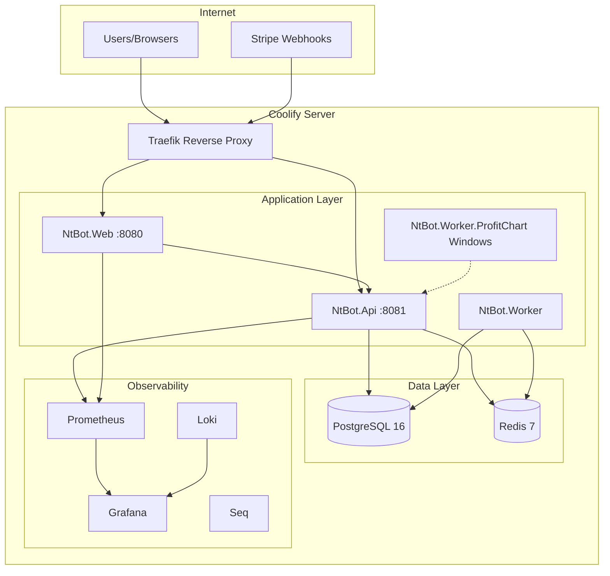
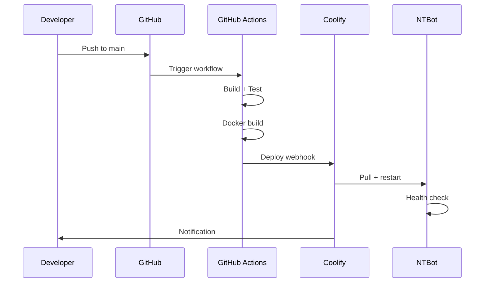

# NTBot — Plano de Deploy (Docker + Coolify + CI/CD)

**Data:** 20 de junho de 2026  
**Target:** Coolify self-hosted + Docker Compose  
**Referência:** `C:\Projetos\barberai\src\DOCKER_DEPLOY.md`

---

## 1. Arquitetura de Deploy



---

## 2. Serviços Docker

### 2.1 Inventário

| Serviço | Imagem/Base | Porta | Réplicas |
|---------|-------------|-------|----------|
| `ntbot-web` | Dockerfile.Web | 8080 | 2+ |
| `ntbot-api` | Dockerfile.Api | 8081 | 2+ |
| `ntbot-worker` | Dockerfile.Worker | — | 1 |
| `ntbot-worker-profitchart` | Windows container | — | 1 (Windows node) |
| `postgres` | postgres:16-alpine | 5432 | 1 |
| `redis` | redis:7-alpine | 6379 | 1 |
| `prometheus` | prom/prometheus | 9090 | 1 |
| `grafana` | grafana/grafana | 3000 | 1 |
| `loki` | grafana/loki | 3100 | 1 |
| `seq` | datalust/seq | 5341 | 1 (staging) |

---

## 3. Dockerfiles

### 3.1 Dockerfile.Web

```dockerfile
# docker/Dockerfile.Web
FROM mcr.microsoft.com/dotnet/aspnet:9.0 AS base
WORKDIR /app
EXPOSE 8080

FROM mcr.microsoft.com/dotnet/sdk:9.0 AS build
WORKDIR /src
COPY ["src/NtBot.Web/NtBot.Web.csproj", "NtBot.Web/"]
COPY ["src/NtBot.Application/NtBot.Application.csproj", "NtBot.Application/"]
COPY ["src/NtBot.Domain/NtBot.Domain.csproj", "NtBot.Domain/"]
COPY ["src/NtBot.Infrastructure/NtBot.Infrastructure.csproj", "NtBot.Infrastructure/"]
COPY ["src/NtBot.Identity/NtBot.Identity.csproj", "NtBot.Identity/"]
COPY ["src/NtBot.Billing/NtBot.Billing.csproj", "NtBot.Billing/"]
COPY ["src/NtBot.Shared/NtBot.Shared.csproj", "NtBot.Shared/"]
RUN dotnet restore "NtBot.Web/NtBot.Web.csproj"
COPY src/ .
WORKDIR "/src/NtBot.Web"
RUN dotnet build -c Release -o /app/build
RUN dotnet publish -c Release -o /app/publish /p:UseAppHost=false

FROM base AS final
WORKDIR /app
COPY --from=build /app/publish .
HEALTHCHECK --interval=30s --timeout=5s --retries=3 \
  CMD curl -f http://localhost:8080/health || exit 1
ENTRYPOINT ["dotnet", "NtBot.Web.dll"]
```

### 3.2 Dockerfile.Api

```dockerfile
# docker/Dockerfile.Api
FROM mcr.microsoft.com/dotnet/aspnet:9.0 AS base
WORKDIR /app
EXPOSE 8081

FROM mcr.microsoft.com/dotnet/sdk:9.0 AS build
WORKDIR /src
# ... similar restore pattern ...
WORKDIR "/src/NtBot.Api"
RUN dotnet publish -c Release -o /app/publish /p:UseAppHost=false

FROM base AS final
WORKDIR /app
COPY --from=build /app/publish .
HEALTHCHECK --interval=30s --timeout=5s --retries=3 \
  CMD curl -f http://localhost:8081/api/health || exit 1
ENTRYPOINT ["dotnet", "NtBot.Api.dll"]
```

### 3.3 Dockerfile.Worker

```dockerfile
# docker/Dockerfile.Worker
FROM mcr.microsoft.com/dotnet/aspnet:9.0 AS base
WORKDIR /app

FROM mcr.microsoft.com/dotnet/sdk:9.0 AS build
WORKDIR /src
# ... restore NtBot.Worker + dependencies ...
RUN dotnet publish "NtBot.Worker/NtBot.Worker.csproj" -c Release -o /app/publish

FROM base AS final
WORKDIR /app
COPY --from=build /app/publish .
ENTRYPOINT ["dotnet", "NtBot.Worker.dll"]
```

**Responsabilidades Worker:**
- TradingOrchestrator loop
- Economic calendar sync
- Market data aggregation
- Background notifications

---

## 4. Docker Compose Files

### 4.1 docker-compose.yml (Development)

```yaml
# docker/docker-compose.yml
version: '3.8'

services:
  postgres:
    image: postgres:16-alpine
    environment:
      POSTGRES_DB: ntbot
      POSTGRES_USER: ntbot
      POSTGRES_PASSWORD: ${POSTGRES_PASSWORD:-devpassword}
    ports:
      - "5432:5432"
    volumes:
      - pgdata:/var/lib/postgresql/data
    healthcheck:
      test: ["CMD-SHELL", "pg_isready -U ntbot"]
      interval: 10s
      timeout: 5s
      retries: 5

  redis:
    image: redis:7-alpine
    ports:
      - "6379:6379"
    healthcheck:
      test: ["CMD", "redis-cli", "ping"]
      interval: 10s

  ntbot-api:
    build:
      context: ..
      dockerfile: docker/Dockerfile.Api
    environment:
      ASPNETCORE_ENVIRONMENT: Development
      ConnectionStrings__DefaultConnection: Host=postgres;Database=ntbot;Username=ntbot;Password=${POSTGRES_PASSWORD:-devpassword}
      Redis__ConnectionString: redis:6379
      Jwt__Key: ${JWT_KEY:-dev-jwt-key-minimum-32-characters-long}
    ports:
      - "5053:8081"
    depends_on:
      postgres:
        condition: service_healthy
      redis:
        condition: service_healthy

  ntbot-web:
    build:
      context: ..
      dockerfile: docker/Dockerfile.Web
    environment:
      ASPNETCORE_ENVIRONMENT: Development
      ApiSettings__BaseUrl: http://ntbot-api:8081
      ConnectionStrings__DefaultConnection: Host=postgres;Database=ntbot;Username=ntbot;Password=${POSTGRES_PASSWORD:-devpassword}
      Redis__ConnectionString: redis:6379
    ports:
      - "5001:8080"
    depends_on:
      - ntbot-api

  seq:
    image: datalust/seq
    environment:
      ACCEPT_EULA: "Y"
    ports:
      - "5341:80"

volumes:
  pgdata:
```

### 4.2 docker-compose.prod.yml

```yaml
# docker/docker-compose.prod.yml
version: '3.8'

services:
  ntbot-api:
    deploy:
      replicas: 2
      resources:
        limits:
          cpus: '1.0'
          memory: 512M
    environment:
      ASPNETCORE_ENVIRONMENT: Production
    restart: unless-stopped

  ntbot-web:
    deploy:
      replicas: 2
      resources:
        limits:
          cpus: '1.0'
          memory: 512M
    restart: unless-stopped

  ntbot-worker:
    build:
      context: ..
      dockerfile: docker/Dockerfile.Worker
    deploy:
      replicas: 1
    restart: unless-stopped

  prometheus:
    image: prom/prometheus:latest
    volumes:
      - ./prometheus/prometheus.yml:/etc/prometheus/prometheus.yml
      - promdata:/prometheus
    ports:
      - "9090:9090"

  grafana:
    image: grafana/grafana:latest
    environment:
      GF_SECURITY_ADMIN_PASSWORD: ${GRAFANA_PASSWORD}
    volumes:
      - ./grafana/provisioning:/etc/grafana/provisioning
      - grafanadata:/var/lib/grafana
    ports:
      - "3000:3000"

  loki:
    image: grafana/loki:latest
    ports:
      - "3100:3100"
    volumes:
      - ./loki/loki-config.yml:/etc/loki/local-config.yaml

volumes:
  promdata:
  grafanadata:
```

### 4.3 docker-compose.coolify.yml

```yaml
# docker/docker-compose.coolify.yml
# Optimized for Coolify deployment — no port bindings (Traefik handles routing)

version: '3.8'

services:
  ntbot-web:
    build:
      context: .
      dockerfile: docker/Dockerfile.Web
    environment:
      ASPNETCORE_ENVIRONMENT: Production
      ASPNETCORE_URLS: http://+:8080
      ConnectionStrings__DefaultConnection: ${DATABASE_URL}
      Redis__ConnectionString: ${REDIS_URL}
      Jwt__Key: ${JWT_SECRET}
      Stripe__SecretKey: ${STRIPE_SECRET_KEY}
      Stripe__WebhookSecret: ${STRIPE_WEBHOOK_SECRET}
      ApiSettings__BaseUrl: http://ntbot-api:8081
    labels:
      - "traefik.enable=true"
      - "traefik.http.routers.ntbot-web.rule=Host(`${APP_DOMAIN}`)"
      - "traefik.http.services.ntbot-web.loadbalancer.server.port=8080"
    healthcheck:
      test: ["CMD", "curl", "-f", "http://localhost:8080/health"]
      interval: 30s
      timeout: 5s
      retries: 3
    restart: unless-stopped

  ntbot-api:
    build:
      context: .
      dockerfile: docker/Dockerfile.Api
    environment:
      ASPNETCORE_ENVIRONMENT: Production
      ASPNETCORE_URLS: http://+:8081
      ConnectionStrings__DefaultConnection: ${DATABASE_URL}
      Redis__ConnectionString: ${REDIS_URL}
      Jwt__Key: ${JWT_SECRET}
      Stripe__SecretKey: ${STRIPE_SECRET_KEY}
      Stripe__WebhookSecret: ${STRIPE_WEBHOOK_SECRET}
    labels:
      - "traefik.enable=true"
      - "traefik.http.routers.ntbot-api.rule=Host(`api.${APP_DOMAIN}`)"
      - "traefik.http.services.ntbot-api.loadbalancer.server.port=8081"
    healthcheck:
      test: ["CMD", "curl", "-f", "http://localhost:8081/api/health"]
      interval: 30s
      timeout: 5s
      retries: 3
    restart: unless-stopped

  ntbot-worker:
    build:
      context: .
      dockerfile: docker/Dockerfile.Worker
    environment:
      ASPNETCORE_ENVIRONMENT: Production
      ConnectionStrings__DefaultConnection: ${DATABASE_URL}
      Redis__ConnectionString: ${REDIS_URL}
    restart: unless-stopped
```

---

## 5. Variáveis de Ambiente

### 5.1 .env.example

```bash
# docker/.env.example

# Application
APP_DOMAIN=ntbot.io
ASPNETCORE_ENVIRONMENT=Production

# Database
DATABASE_URL=Host=postgres;Port=5432;Database=ntbot;Username=ntbot;Password=CHANGE_ME
POSTGRES_PASSWORD=CHANGE_ME

# Redis
REDIS_URL=redis:6379

# Auth
JWT_SECRET=generate-256-bit-random-key-here
JWT_ISSUER=NTBot
JWT_AUDIENCE=NTBotUsers

# Stripe
STRIPE_SECRET_KEY=sk_live_...
STRIPE_PUBLISHABLE_KEY=pk_live_...
STRIPE_WEBHOOK_SECRET=whsec_...

# SMTP
SMTP_HOST=smtp.example.com
SMTP_PORT=587
SMTP_USER=noreply@ntbot.io
SMTP_PASSWORD=CHANGE_ME

# Market Data (optional)
POLYGON_API_KEY=
FMP_API_KEY=
TRADINGVIEW_LICENSE=

# Observability
GRAFANA_PASSWORD=CHANGE_ME
SEQ_API_KEY=

# ProfitChart (Windows worker only)
PROFITCHART_API_URL=http://ntbot-api:8081
```

### 5.2 Coolify Secrets

Configurar no Coolify UI → Environment Variables (encrypted):

| Secret | Serviço |
|--------|---------|
| DATABASE_URL | web, api, worker |
| REDIS_URL | web, api, worker |
| JWT_SECRET | web, api |
| STRIPE_SECRET_KEY | web, api |
| STRIPE_WEBHOOK_SECRET | api |
| SMTP_PASSWORD | web, worker |

**Nunca commitar secrets** — usar Coolify secrets ou GitHub Actions secrets.

---

## 6. Coolify Setup

### 6.1 Serviços a Provisionar

| # | Serviço Coolify | Config |
|---|-----------------|--------|
| 1 | PostgreSQL 16 | Volume persistente, backup daily |
| 2 | Redis 7 | Volume persistente |
| 3 | NtBot (compose) | docker-compose.coolify.yml |
| 4 | Grafana | docker-compose.prod observability |
| 5 | Prometheus | Scrape ntbot-api:8081/metrics |
| 6 | Loki | Log aggregation |
| 7 | Seq | Dev/staging only |

### 6.2 Deploy Flow



### 6.3 Portar de BarberAI

Reutilizar de `barberai/src/BarberAI.Api/Extensions/`:

```csharp
// ConfigureCoolifyHosting() — adaptar para NtBot.Web
public static WebApplicationBuilder ConfigureCoolifyHosting(this WebApplicationBuilder builder)
{
    builder.WebHost.ConfigureKestrel(options =>
    {
        options.ListenAnyIP(int.Parse(
            Environment.GetEnvironmentVariable("PORT") ?? "8080"));
    });
    
    // Forwarded headers for Traefik
    builder.Services.Configure<ForwardedHeadersOptions>(options =>
    {
        options.ForwardedHeaders = ForwardedHeaders.XForwardedFor | 
                                    ForwardedHeaders.XForwardedProto;
    });
    
    return builder;
}
```

### 6.4 Domains

| Ambiente | Web | API |
|----------|-----|-----|
| Production | app.ntbot.io | api.ntbot.io |
| Staging | staging.ntbot.io | api-staging.ntbot.io |
| Dev | localhost:5001 | localhost:5053 |

---

## 7. Health Checks

### 7.1 Endpoints

| Serviço | Endpoint | Checks |
|---------|----------|--------|
| NtBot.Web | `/health` | Self |
| NtBot.Web | `/health/ready` | DB, Redis, API |
| NtBot.Api | `/api/health` | DB, Redis |
| NtBot.Api | `/api/health/ready` | DB migrations applied |
| NtBot.Worker | `/health` | DB, Redis, orchestrator running |

### 7.2 Implementação

```csharp
builder.Services.AddHealthChecks()
    .AddNpgSql(connectionString, name: "postgresql")
    .AddRedis(redisConnection, name: "redis")
    .AddCheck<TradingOrchestratorHealthCheck>("trading-orchestrator");

app.MapHealthChecks("/health");
app.MapHealthChecks("/health/ready", new HealthCheckOptions
{
    Predicate = check => check.Tags.Contains("ready")
});
```

---

## 8. Volumes & Backups

### 8.1 Volumes Persistentes

| Volume | Mount | Serviço |
|--------|-------|---------|
| `pgdata` | `/var/lib/postgresql/data` | postgres |
| `redisdata` | `/data` | redis |
| `grafanadata` | `/var/lib/grafana` | grafana |
| `promdata` | `/prometheus` | prometheus |

### 8.2 Backup Strategy

```bash
#!/bin/bash
# scripts/backup-postgres.sh

TIMESTAMP=$(date +%Y%m%d_%H%M%S)
BACKUP_FILE="ntbot_backup_${TIMESTAMP}.sql.gz"

pg_dump -h $PG_HOST -U $PG_USER -d ntbot | gzip > /backups/$BACKUP_FILE

# Retain last 30 daily backups
find /backups -name "ntbot_backup_*.sql.gz" -mtime +30 -delete
```

**Coolify:** Configurar scheduled backup no PostgreSQL service (daily 03:00 UTC).

**Restore:**
```bash
gunzip -c ntbot_backup_YYYYMMDD.sql.gz | psql -h $PG_HOST -U $PG_USER -d ntbot
```

---

## 9. CI/CD — GitHub Actions

### 9.1 `.github/workflows/ci.yml`

```yaml
name: CI

on:
  push:
    branches: [main, develop]
  pull_request:
    branches: [main]

env:
  DOTNET_VERSION: '9.0.x'

jobs:
  build-and-test:
    runs-on: ubuntu-latest
    steps:
      - uses: actions/checkout@v4

      - name: Setup .NET
        uses: actions/setup-dotnet@v4
        with:
          dotnet-version: ${{ env.DOTNET_VERSION }}

      - name: Restore
        run: dotnet restore src/NtBot.sln

      - name: Build
        run: dotnet build src/NtBot.sln --configuration Release --no-restore

      - name: Test
        run: dotnet test tests/ --configuration Release --no-build --verbosity normal

      - name: Code Analysis
        run: dotnet format src/NtBot.sln --verify-no-changes

  docker-build:
    needs: build-and-test
    if: github.ref == 'refs/heads/main'
    runs-on: ubuntu-latest
    steps:
      - uses: actions/checkout@v4

      - name: Build Web image
        run: docker build -f docker/Dockerfile.Web -t ntbot-web:${{ github.sha }} .

      - name: Build API image
        run: docker build -f docker/Dockerfile.Api -t ntbot-api:${{ github.sha }} .

      - name: Build Worker image
        run: docker build -f docker/Dockerfile.Worker -t ntbot-worker:${{ github.sha }} .
```

### 9.2 `.github/workflows/deploy.yml`

```yaml
name: Deploy to Coolify

on:
  push:
    branches: [main]

jobs:
  deploy:
    runs-on: ubuntu-latest
    steps:
      - name: Trigger Coolify Deploy
        run: |
          curl -X POST "${{ secrets.COOLIFY_WEBHOOK_URL }}" \
            -H "Authorization: Bearer ${{ secrets.COOLIFY_TOKEN }}"
```

---

## 10. Observabilidade Stack

### 10.1 Prometheus Config

```yaml
# docker/prometheus/prometheus.yml
global:
  scrape_interval: 15s

scrape_configs:
  - job_name: 'ntbot-api'
    static_configs:
      - targets: ['ntbot-api:8081']
    metrics_path: /metrics

  - job_name: 'ntbot-web'
    static_configs:
      - targets: ['ntbot-web:8080']
    metrics_path: /metrics
```

### 10.2 Grafana Dashboards

| Dashboard | Panels |
|-----------|--------|
| NTBot Overview | Active tenants, requests/s, error rate |
| Trading | Signals/min, orders/min, PnL aggregate |
| API Performance | Latency p50/p95/p99, endpoint breakdown |
| Infrastructure | CPU, memory, DB connections, Redis hit rate |
| SignalR | Connections, messages/s, group sizes |

### 10.3 Logging Pipeline

```
App (Serilog) → Console (JSON) → Loki → Grafana
                              → Seq (dev/staging)
```

```csharp
// Program.cs
builder.Host.UseSerilog((ctx, cfg) => cfg
    .ReadFrom.Configuration(ctx.Configuration)
    .Enrich.FromLogContext()
    .WriteTo.Console(new JsonFormatter())
    .WriteTo.GrafanaLoki("http://loki:3100"));
```

---

## 11. ProfitChart Windows Worker

ProfitChart RTD requer Windows. Deploy separado:

```
┌─────────────────────────┐
│  Windows Server/PC      │
│  ┌───────────────────┐  │
│  │ ProfitChart       │  │
│  │ (RTD enabled)     │  │
│  └────────┬──────────┘  │
│  ┌────────▼──────────┐  │
│  │ NtBot.Worker.PC   │  │──HTTP/SignalR──▶ NtBot.Api (Linux)
│  └───────────────────┘  │
└─────────────────────────┘
```

**Alternativa:** Manter ProfitService como SignalR client conectando a bridge Windows existente.

---

## 12. SSL/TLS

Coolify + Traefik gerencia automaticamente via Let's Encrypt:

```yaml
labels:
  - "traefik.http.routers.ntbot-web.tls=true"
  - "traefik.http.routers.ntbot-web.tls.certresolver=letsencrypt"
```

**Stripe Webhooks:** Requer HTTPS público em `api.ntbot.io/api/webhooks/stripe`.

---

## 13. Checklist de Deploy

### Pré-Deploy
- [ ] Secrets rotacionados (DB, JWT, Stripe)
- [ ] DNS apontando para Coolify server
- [ ] Stripe webhook URL configurada
- [ ] SMTP configurado para auth emails
- [ ] Migrations aplicadas

### Deploy
- [ ] PostgreSQL provisionado com backup
- [ ] Redis provisionado
- [ ] docker-compose.coolify.yml deployado
- [ ] Health checks passando
- [ ] SSL ativo

### Pós-Deploy
- [ ] Smoke test: login, dashboard, API health
- [ ] Stripe test checkout (test mode)
- [ ] Grafana dashboards importados
- [ ] Alertas configurados
- [ ] Backup restore testado

---

## 14. Rollback Procedure

```bash
# 1. Identificar versão anterior no Coolify
# 2. Redeploy previous image tag
coolify deploy --image ntbot-web:previous-sha

# 3. Se DB migration falhou:
dotnet ef database update PreviousMigration --project NtBot.Infrastructure

# 4. Verificar health checks
curl https://api.ntbot.io/api/health
```

---

## 15. Estimativa de Recursos (Produção MVP)

| Serviço | CPU | RAM | Disco |
|---------|-----|-----|-------|
| ntbot-web × 2 | 1 core each | 512MB each | — |
| ntbot-api × 2 | 1 core each | 512MB each | — |
| ntbot-worker | 1 core | 512MB | — |
| PostgreSQL | 2 cores | 2GB | 50GB SSD |
| Redis | 0.5 core | 256MB | 1GB |
| Grafana+Prometheus+Loki | 1 core | 1GB | 10GB |
| **Total mínimo** | **~8 cores** | **~6GB** | **~60GB** |

**Escala para 1000+ users:** Adicionar réplicas web/api, Redis cluster, PG read replicas.

---

*Plano executado nas Fases 12–14 do MIGRATION_PLAN.md.*
