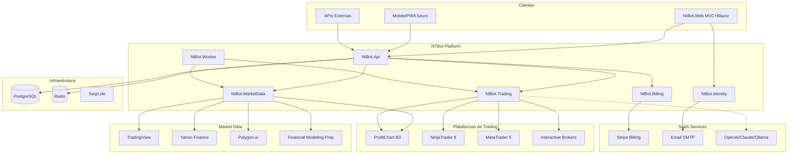

# NTBot — Mapa de Integrações

**Data:** 20 de junho de 2026  
**Escopo:** Integrações existentes, planejadas e dependências externas

---

## 1. Diagrama Geral de Integrações



---

## 2. Integrações Existentes (Implementadas)

### 2.1 ProfitChart / B3 RTD

| Atributo | Valor |
|----------|-------|
| **Status** | 🟢 Implementado (~80%) |
| **Localização** | `NTBot.Api/Services/Profit/`, `Hubs/ProfitChartHub.cs`, `Controllers/ProfitChartController.cs` |
| **Protocolo** | RTD COM (Windows) → SignalR Client bridge → REST + WebSocket |
| **Dependência** | ProfitChart desktop rodando, `Interop.RTDTrading.dll`, `rtd_config.json` |
| **Endpoints REST** | 8 endpoints em `/api/profitchart/*` |
| **SignalR Hub** | `/hubs/profitchart` — SubscribeTicker, TickUpdate, etc. |
| **Mercados** | B3 — WIN, WDO, PETR4, VALE3, USD/BRL, BTCUSD |
| **Frontend** | React `profitchart/` components — funcional |
| **Destino migração** | `NtBot.MarketData.Providers.ProfitChartProvider` |
| **Limitação** | Windows-only para RTD; deploy Linux requer worker Windows separado |

**Configuração:**
```json
// rtd_config.json
{
  "WIN": { "TICK": "WINJ25", "BASE": 1, "AssetType": "FUTURE", "IsActive": true }
}
```

---

### 2.2 NinjaTrader 8

| Atributo | Valor |
|----------|-------|
| **Status** | 🟡 Código referência (~50%) |
| **Localização** | `NTBot.Api/Services/NinjaTrader/NinjaTraderService.cs` |
| **Protocolo** | REST + WebSocket híbrido |
| **Config** | `NinjaTrader:ApiBaseUrl` = `http://localhost:8080` |
| **Funcionalidades** | Market data, orders (Market/Limit/Stop), positions, events |
| **Documentação** | `NINJATRADER_INTEGRATION_GUIDE.md`, `NINJATRADER_SETUP.md` |
| **Scripts** | `NinjaScript/` |
| **Destino** | `NtBot.Trading.Connectors.NinjaTraderConnector` |
| **Limitação** | ATI requer NT8 instalado, porta 36973, Windows |

---

### 2.3 MetaTrader 5

| Atributo | Valor |
|----------|-------|
| **Status** | 🟡 Bridge parcial (~30%) |
| **Localização** | `MT5/Experts/TradeAssistant.mq5`, `MT5/Include/NTBot.mqh`, `Controllers/MT5Controller.cs` |
| **Protocolo** | HTTP polling — EA → API |
| **Endpoints** | `POST /api/mt5/connect`, `/update`, `/heartbeat`, `GET /status` |
| **SignalR** | TradingHub — SubscribeToMT5, SendTradeCommand |
| **Destino** | `NtBot.Trading.Connectors.MetaTraderConnector` |
| **Limitação** | Comunicação unidirecional EA→API; sem order execution validada |

---

### 2.4 SignalR (Internal)

| Hub | Rota | Status | Consumer |
|-----|------|--------|----------|
| ProfitChartHub | `/hubs/profitchart` | 🟢 Real | React profitchart.signalr.ts |
| TradingHub | `/hubs/trading` | 🟡 Stub | React (disabled) |
| MarketHub | `/hubs/market` | 🟡 Stub | — |
| RiskHub | `/hubs/risk` | 🟡 Stub | — |
| ExecutionHub | `/hubs/execution` | 🟡 Stub | — |
| NotificationHub | `/hubs/notification` | 🟡 Stub | — |

**Pacote:** Microsoft.AspNetCore.SignalR 1.1.0 + Client 8.0.0  
**Destino:** Redis backplane + wire-up real na Fase 10

---

### 2.5 PostgreSQL

| Atributo | Valor |
|----------|-------|
| **Status** | 🟢 Configurado |
| **Provider** | Npgsql.EntityFrameworkCore.PostgreSQL 8.0.0 |
| **Fallbacks** | SQLite (dev), SQL Server |
| **Migrations** | `20260512091406_InitialCreate` |
| **Mesmo host que BarberAI** | 147.79.111.88:5435 (⚠️ rotacionar credenciais) |

---

## 3. Integrações Parcialmente Implementadas

### 3.1 Wyckoff Analysis Engine

| Atributo | Valor |
|----------|-------|
| **Status** | 🟢 Engine completo, API exposta |
| **Localização** | `Services/Wyckoff/WyckoffService.cs` |
| **Endpoint** | `GET /api/analysis/wyckoff/{symbol}?timeframe=5m` |
| **Input** | Requer candles (atualmente mock/NT data) |
| **Frontend** | Placeholder React |

### 3.2 Macro Context Analyzer

| Atributo | Valor |
|----------|-------|
| **Status** | 🟢 Engine completo |
| **Localização** | `Services/Macro/MacroContextService.cs` |
| **Endpoint** | `GET /api/analysis/macro/{symbol}` |
| **Referências** | ES, NQ, DXY, VIX |
| **Frontend** | Placeholder React |

### 3.3 Quant Strategy (GEX + Correlation)

| Atributo | Valor |
|----------|-------|
| **Status** | 🟢 Lógica completa, dados mock |
| **Localização** | `Strategies/QuantStrategy.cs`, `Services/Correlation/`, `Services/GammaExposure/` |
| **Endpoints** | 6 em `/api/quantstrategy/*` |
| **Frontend** | React QuantStrategy.tsx — **funcional** |
| **Dados reais pendentes** | Opções B3 (OpLab), NQ realtime |

### 3.4 Grid Trading Engine

| Atributo | Valor |
|----------|-------|
| **Status** | 🟡 Lógica + API, DB stub |
| **Localização** | `Services/GridEngine.cs`, `Controllers/GridController.cs` |
| **Auth** | `[Authorize]` (único controller protegido) |
| **Frontend** | React mock UI |

### 3.5 Risk Manager

| Atributo | Valor |
|----------|-------|
| **Status** | 🟡 Lógica parcial |
| **Localização** | `Services/RiskManager.cs` |
| **Depende de** | TradingService (mock) |
| **Frontend** | React mock UI |

---

## 4. Integrações Documentadas mas NÃO Implementadas

### 4.1 Economic Calendar

| Atributo | Valor |
|----------|-------|
| **Status** | 🔴 Config only |
| **Config** | `EconomicCalendar:ApiBaseUrl` → Financial Modeling Prep |
| **Entity** | `EconomicEvent` (DB ready) |
| **Service** | Comentado no Program.cs |
| **Destino** | `NtBot.MarketData.Services.EconomicCalendarService` |
| **API sugerida** | [FMP Economic Calendar](https://financialmodelingprep.com/developer/docs) |

### 4.2 News AI Analyzer

| Atributo | Valor |
|----------|-------|
| **Status** | 🔴 Não existe |
| **Config** | `NewsAnalyzer:SentimentApiUrl` → localhost:8000 |
| **Entity** | `NewsAnalysis` (DB ready) |
| **Plano** | Microserviço Python FastAPI + FinBERT |
| **Destino** | `NtBot.Analytics` ou serviço externo |

### 4.3 TradingView

| Atributo | Valor |
|----------|-------|
| **Status** | 🔴 Não implementado |
| **Documentado em** | ARCHITECTURE.md, README.md |
| **Pacote frontend** | lightweight-charts instalado, não usado |
| **Destino** | `NtBot.MarketData.Providers.TradingViewProvider` + JS widgets |
| **Componentes** | Advanced Chart, Market Overview, Heatmap, Screener, Calendar |

### 4.4 Redis

| Atributo | Valor |
|----------|-------|
| **Status** | 🔴 Não implementado |
| **Uso planejado** | Cache market data, sessions, rate limits, SignalR backplane |
| **Referência** | BarberAI DOCKER_DEPLOY.md menciona Redis externo |

### 4.5 Interactive Brokers

| Atributo | Valor |
|----------|-------|
| **Status** | 🔴 Não implementado |
| **Destino** | `NtBot.Trading.Connectors.InteractiveBrokersConnector` |
| **API** | TWS API / IB Gateway |

---

## 5. Integrações Externas — BarberAI (Reaproveitamento)

> Path: `C:\Projetos\barberai\src\`

### 5.1 Stripe Billing

| Atributo | Valor |
|----------|-------|
| **Status** | 🟢 Implementado no BarberAI |
| **Arquivos** | `StripeService.cs`, `PaymentService.cs`, `PaymentController.cs` |
| **Pacote** | Stripe.net 47.3.0 |
| **Features** | Checkout Sessions, Subscriptions, Webhooks, Cancel, Trial |
| **Docs** | `STRIPE_IMPLEMENTACAO_COMPLETA.md`, `README_STRIPE_FINAL.md` |
| **Destino** | `NtBot.Billing` |
| **Adaptação** | Plans: Free/Starter/Pro/Funded/Institutional |

### 5.2 Authentication

| Atributo | Valor |
|----------|-------|
| **Status** | 🟢 MVC Cookie Auth completo |
| **Arquivos** | `AuthViewController.cs`, Views, `OtpVerificationService.cs` |
| **Features** | Login, Register, ForgotPassword (OTP email), subscription gate |
| **Docs** | `API_AUTHENTICATION.md`, `FORGOT_PASSWORD_FIX.md` |
| **Destino** | `NtBot.Identity` + `NtBot.Web/Areas/Account` |
| **Gap vs NTBot spec** | Adicionar JWT + Refresh Token + MFA TOTP |

### 5.3 Email (SMTP)

| Atributo | Valor |
|----------|-------|
| **Status** | 🟢 Implementado |
| **Arquivos** | `IEmailService`, `SmtpSettings` |
| **Destino** | `NtBot.Notifications` |

### 5.4 PostgreSQL + DataProtection

| Atributo | Valor |
|----------|-------|
| **Status** | 🟢 Produção |
| **Pattern** | Keys persistidas em PG (`DataProtectionKeys` table) |
| **Destino** | `NtBot.Infrastructure` |

### 5.5 Coolify Deploy

| Atributo | Valor |
|----------|-------|
| **Status** | 🟢 Configurado |
| **Arquivos** | `ConfigureCoolifyHosting()`, `DOCKER_DEPLOY.md`, `deploy.ps1` |
| **Destino** | `deploy/` + `docker-compose.coolify.yml` |

### 5.6 MercadoPago (Descartar)

| Atributo | Valor |
|----------|-------|
| **Status** | 🟢 Existe no BarberAI |
| **Decisão** | **Não portar** — NTBot usa Stripe global |

---

## 6. Integrações Planejadas (Futuras)

### 6.1 AI Providers (NtBot.Analytics)

| Provider | Uso | Prioridade |
|----------|-----|------------|
| OpenAI GPT-4 | Market summary, signal explanation | v2.5 |
| Claude | Technical analysis | v2.5 |
| Gemini | Quantitative insights | v3.0 |
| Ollama (local) | Dev/privacy mode | v2.5 |
| OpenRouter | Multi-model gateway | v3.0 |

### 6.2 Observabilidade

| Ferramenta | Função | Fase |
|------------|--------|------|
| OpenTelemetry | Tracing + metrics | 11 |
| Prometheus | Metrics storage | 11 |
| Grafana | Dashboards | 11 |
| Loki | Log aggregation | 11 |
| Seq | Dev structured logs | 11 |

### 6.3 Market Data Providers (Adicionais)

| Provider | Mercados | API Key |
|----------|----------|---------|
| Polygon.io | US stocks, options, forex | Required |
| Alpha Vantage | US equities, forex | Free tier |
| OpLab | B3 options (GEX real) | Required |
| Binance API | Crypto | Optional |
| CME DataMine | CME futures | Enterprise |

---

## 7. Matriz de Dependências

| Integração | Depende de | Bloqueia |
|------------|------------|----------|
| ProfitChart | Windows + ProfitChart desktop | B3 realtime em Linux |
| NinjaTrader | NT8 + ATI + Windows | US futures execution |
| MT5 | MT5 terminal + EA | Forex/CFD execution |
| TradingView | API key (widget) | Charts avançados |
| Stripe | Stripe account + webhook URL | Billing SaaS |
| PostgreSQL | DB server | Tudo |
| Redis | Redis server | Scale SignalR, cache |
| SMTP | Email server | Auth flows |
| FMP | API key | Economic calendar |
| IB | TWS/Gateway | US equities options |

---

## 8. Mapa de Portas e URLs

| Serviço | Dev URL | Prod URL |
|---------|---------|----------|
| NtBot.Web | https://localhost:5001 | https://app.ntbot.io |
| NtBot.Api | http://localhost:5053 | https://api.ntbot.io |
| Swagger | /swagger | /swagger (dev only) |
| SignalR | ws://localhost:5053/hubs/* | wss://api.ntbot.io/hubs/* |
| PostgreSQL | localhost:5432 | Coolify internal |
| Redis | localhost:6379 | Coolify internal |
| ProfitChart RTD | localhost (COM) | Windows worker |
| NinjaTrader ATI | localhost:36973 | Windows worker |
| Stripe Webhook | /api/webhooks/stripe | https://api.ntbot.io/api/webhooks/stripe |

---

## 9. Priorização de Integrações

### P0 — MVP SaaS
1. PostgreSQL (consolidar)
2. Stripe (port BarberAI)
3. Auth (port BarberAI + JWT)
4. ProfitChart (manter)
5. SignalR ProfitChartHub (wire Blazor)

### P1 — Trading Platform
6. TradingView widgets
7. NinjaTrader connector (validar E2E)
8. MT5 connector (validar E2E)
9. Redis cache + backplane
10. Economic Calendar (FMP)

### P2 — Enterprise
11. Interactive Brokers
12. Polygon.io market data
13. News AI microservice
14. OpenTelemetry stack
15. AI Analytics providers

---

## 10. Contratos de Interface (Target State)

```csharp
// Market Data
public interface IMarketDataProvider { /* ver ARCHITECTURE_PROPOSAL.md */ }

// Trading
public interface IBrokerConnector { /* ver ARCHITECTURE_PROPOSAL.md */ }

// Billing
public interface IBillingService
{
    Task<CheckoutResult> CreateCheckoutAsync(Guid tenantId, string planId);
    Task HandleWebhookAsync(string payload, string signature);
    Task<PortalResult> CreatePortalSessionAsync(Guid tenantId);
}

// Notifications
public interface INotificationService
{
    Task SendEmailAsync(string to, string template, object data);
    Task PushToTenantAsync(Guid tenantId, Notification notification);
}
```

---

*Mapa vivo — atualizar conforme integrações forem implementadas.*
