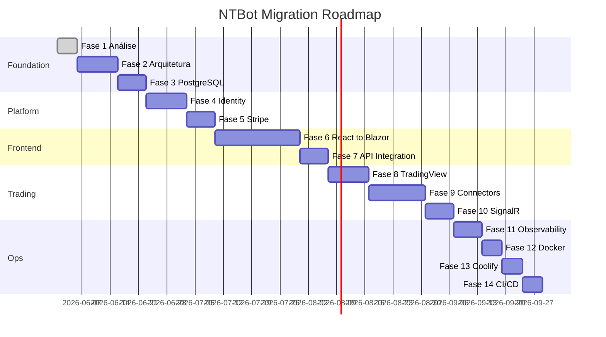

# NTBot — Plano de Migração Detalhado

**Data:** 20 de junho de 2026  
**Duração estimada total:** 14–18 semanas (1 dev senior full-time)  
**Pré-requisito:** Aprovação desta análise + remediação P0 de segurança

---

## Visão Geral das Fases



---

## FASE 0 — Remediação Imediata (Pré-Migração)

**Duração:** 1–2 dias  
**Bloqueante:** Sim

| # | Ação | Responsável |
|---|------|-------------|
| 0.1 | Rotacionar senha PostgreSQL exposta em `appsettings.json` | DevOps |
| 0.2 | Remover credenciais do repositório; usar User Secrets / env vars | Dev |
| 0.3 | Gerar JWT key segura (256-bit) | Dev |
| 0.4 | Adicionar `appsettings.json` secrets ao `.gitignore` pattern review | Dev |
| 0.5 | Confirmar path BarberAI: `C:\Projetos\barberai` | PO |

---

## FASE 1 — Análise Completa ✅

**Duração:** 3–5 dias  
**Status:** CONCLUÍDA

**Entregáveis:**
- [x] `docs/REPOSITORY_ANALYSIS.md`
- [x] `docs/ARCHITECTURE_PROPOSAL.md`
- [x] `docs/MIGRATION_PLAN.md`
- [x] `docs/INTEGRATIONS_MAP.md`
- [x] `docs/DATABASE_PLAN.md`
- [x] `docs/DEPLOYMENT_PLAN.md`

---

## FASE 2 — Nova Arquitetura (.NET 9)

**Duração:** 8–10 dias  
**Depende de:** Fase 0, Fase 1

### Objetivos
- Criar estrutura `src/` multi-projeto
- Upgrade .NET 8 → .NET 9
- Configurar MediatR, FluentValidation, AutoMapper
- Migrar código existente para camadas corretas

### Tarefas

| # | Tarefa | Origem | Destino |
|---|--------|--------|---------|
| 2.1 | Criar solution `NtBot.sln` nova estrutura | — | `src/` |
| 2.2 | Upgrade target framework net9.0 | NTBot.Api.csproj | Todos os projetos |
| 2.3 | Extrair entidades | Models/ + Domain/ | NtBot.Domain |
| 2.4 | Migrar DbContext | Data/NTBotDbContext | NtBot.Infrastructure |
| 2.5 | Migrar services | Services/* | NtBot.Application + Trading + MarketData |
| 2.6 | Migrar controllers | Controllers/* | NtBot.Api (thin) |
| 2.7 | Migrar hubs | Hubs/* | NtBot.Api |
| 2.8 | Configurar MediatR pipeline | — | NtBot.Application |
| 2.9 | Criar NtBot.Shared | — | Constants, extensions |
| 2.10 | Manter NTBot.Api legado funcionando (strangler fig) | — | Parallel run |

### Critério de Aceite
- [ ] `dotnet build` sem erros em todos os projetos
- [ ] Endpoints existentes respondem igual ao monolito
- [ ] Testes de smoke passam

---

## FASE 3 — Banco PostgreSQL

**Duração:** 5–7 dias  
**Depende de:** Fase 2

### Tarefas

| # | Tarefa | Detalhe |
|---|--------|---------|
| 3.1 | Consolidar schema (ver DATABASE_PLAN.md) | Migrations limpas |
| 3.2 | Adicionar tabelas billing | Subscriptions, Plans, BillingHistory |
| 3.3 | Adicionar tabelas identity | RefreshTokens, EmailConfirmations, MfaSecrets |
| 3.4 | Adicionar tabelas audit | AuditLogs, SystemEvents |
| 3.5 | Adicionar tabelas broker | BrokerConnections, TradingAccounts |
| 3.6 | Implementar global query filters (TenantId) | EF Core |
| 3.7 | Seed data dev | Tenant + admin + plans |
| 3.8 | TimescaleDB extension (opcional) | Candles, TickData hypertables |

### Critério de Aceite
- [ ] `dotnet ef database update` limpo
- [ ] Row-level tenant isolation funcional
- [ ] Backup script testado

---

## FASE 4 — Identity (BarberAI)

**Duração:** 8–10 dias  
**Depende de:** Fase 3

### Origem BarberAI → Destino NtBot

| Componente BarberAI | Destino NtBot |
|---------------------|---------------|
| `AuthViewController.cs` | `NtBot.Web/Areas/Account/` |
| Views Auth (Login, Register, ForgotPassword) | Razor adaptadas |
| `OtpVerificationService` | `NtBot.Identity` |
| `IEmailService` / SMTP | `NtBot.Notifications` |
| Cookie auth + DataProtection PG | `NtBot.Web/Program.cs` |
| User/Account entities | Adaptar para Tenant/User NTBot |

### Tarefas

| # | Tarefa |
|---|--------|
| 4.1 | Criar NtBot.Identity project |
| 4.2 | Port Register/Login/ForgotPassword views |
| 4.3 | Implementar JWT issuance + refresh token |
| 4.4 | Implementar MFA TOTP |
| 4.5 | Email confirmation flow |
| 4.6 | Roles: Admin, Support, Free, Starter, Pro, Enterprise |
| 4.7 | Policy-based authorization (plan limits) |
| 4.8 | Proteger todos os endpoints existentes |
| 4.9 | Migrar GridController `[Authorize]` pattern global |

### Critério de Aceite
- [ ] Login/logout/register funcionando
- [ ] JWT + refresh token para API
- [ ] MFA opcional configurável
- [ ] Endpoints protegidos retornam 401

---

## FASE 5 — Stripe Billing (BarberAI)

**Duração:** 5–7 dias  
**Depende de:** Fase 4

### Origem → Destino

| BarberAI | NtBot |
|----------|-------|
| `StripeService.cs` | `NtBot.Billing/Services/StripeService.cs` |
| `PaymentService.cs` | `NtBot.Billing/Services/BillingService.cs` |
| `PaymentController.cs` | `NtBot.Web/Areas/Account/BillingController` |
| `Subscription.cs`, `Plan.cs` | `NtBot.Domain/Entities/` |
| Webhook handler | `NtBot.Api/Endpoints/StripeWebhook.cs` |

### Planos a Configurar no Stripe Dashboard

| Plano | Stripe Price ID | Features |
|-------|-----------------|----------|
| Free | price_free | Paper trading, 1 strategy |
| Starter | price_starter | 3 strategies, B3 realtime |
| Trader Pro | price_pro | 10 strategies, all markets |
| Funded Trader | price_funded | Unlimited, priority |
| Institutional | price_inst | Custom |

### Tarefas

| # | Tarefa |
|---|--------|
| 5.1 | Criar NtBot.Billing project |
| 5.2 | Port StripeService + adapt plans |
| 5.3 | Checkout Session flow |
| 5.4 | Customer Portal integration |
| 5.5 | Webhook endpoint + idempotency |
| 5.6 | Trial, upgrade, downgrade, cancel flows |
| 5.7 | Coupon support |
| 5.8 | Billing UI (Blazor) — plan selection, invoices |
| 5.9 | Enforce plan limits middleware |

### Critério de Aceite
- [ ] Checkout Stripe test mode funcional
- [ ] Webhook atualiza subscription no DB
- [ ] Login bloqueia se subscription expired (como BarberAI)
- [ ] Customer portal acessível

---

## FASE 6 — Migração React → MVC + Blazor

**Duração:** 15–21 dias  
**Depende de:** Fase 5

Esta é a fase mais volumosa. Estratégia: **migrar tela a tela** mantendo identidade visual.

### Mapa de Migração de Telas

| React Page | Blazor/MVC Destino | Prioridade | Complexidade |
|------------|-------------------|------------|--------------|
| MainLayout | `Components/Layout/AppLayout.razor` | P0 | Média |
| Dashboard | `Areas/App/Pages/Dashboard.razor` | P0 | Alta |
| ProfitChart | `Areas/App/Pages/ProfitChart.razor` | P0 | Alta |
| QuantStrategy | `Areas/App/Pages/Quant.razor` | P0 | Alta |
| ScalpingPanel | `Areas/App/Pages/Scalping.razor` | P1 | Alta |
| GridManager | `Areas/App/Pages/GridManager.razor` | P1 | Média |
| Positions | `Areas/App/Pages/Positions.razor` | P1 | Média |
| RiskManagement | `Areas/App/Pages/Risk.razor` | P1 | Média |
| WyckoffAnalysis | `Areas/App/Pages/Wyckoff.razor` | P1 | Alta |
| MacroAnalysis | `Areas/App/Pages/Macro.razor` | P1 | Média |
| Signals | `Areas/App/Pages/Signals.razor` | P1 | Média |
| Trades | `Areas/App/Pages/Trades.razor` | P1 | Média |
| Settings | `Areas/App/Pages/Settings.razor` | P2 | Baixa |
| — (novo) | `Pages/Index.cshtml` (Landing SSR) | P0 | Média |
| — (novo) | `Pages/Pricing.cshtml` | P0 | Baixa |
| — (novo) | `Areas/Admin/` | P1 | Alta |
| — (novo) | `Areas/Account/Billing.razor` | P0 | Média |

### Componentes Globais a Criar

| React Component | Blazor Component | Reuso de lógica |
|-----------------|------------------|-----------------|
| Sidebar (MainLayout) | `Sidebar.razor` | Nav items do MainLayout.tsx |
| Header/Navbar | `Navbar.razor` | Symbol selector |
| TickerCard | `MarketTicker.razor` | profitchart.signalr.ts → C# SignalR |
| SignalCard (quant) | `SignalCard.razor` | Port direto |
| GEXChart | `PerformanceChart.razor` | SVG/Chart.js interop |
| BookOfertas | `OrderBook.razor` | Port direto |
| Stat cards | `MetricCard.razor`, `PnLCard.razor` | Dashboard.tsx |
| — | `BrokerStatus.razor` | Novo |
| — | `TradingPanel.razor` | ScalpingPanel |
| — | `NotificationCenter.razor` | Novo |
| — | `HeatMap.razor` | TradingView widget |
| — | `PositionGrid.razor`, `TradeGrid.razor` | Positions/Trades pages |

### Design System Migration

1. Converter `tailwind.config.js` tokens → `wwwroot/css/design-system.css`
2. Usar Tailwind via CDN ou build pipeline para Blazor (opcional)
3. Manter paleta slate + primary sky existente, evoluir para tokens premium

### Tarefas Sequenciais

| Semana | Entregável |
|--------|------------|
| S1 | NtBot.Web scaffold, Layout, Landing, Login |
| S2 | Dashboard + MetricCards + ProfitChart |
| S3 | Quant + Wyckoff + Macro |
| S4 | Scalping, Grid, Positions, Risk |
| S5 | Signals, Trades, Settings, Admin |

### Critério de Aceite
- [ ] Zero dependência de React/npm
- [ ] Todas as 12+ telas funcionais
- [ ] Dark theme consistente
- [ ] Lighthouse SEO > 90 na landing
- [ ] `ntbot-dashboard/` marcado deprecated

---

## FASE 7 — Integração NtBot.Api

**Duração:** 5–7 dias  
**Depende de:** Fase 6

| # | Tarefa |
|---|--------|
| 7.1 | NtBot.Web consome NtBot.Api via typed HttpClient |
| 7.2 | Refatorar controllers → MediatR handlers |
| 7.3 | Versionar API (`/api/v1/`) |
| 7.4 | Swagger com auth |
| 7.5 | CORS restrito ao domínio NtBot.Web |
| 7.6 | Deprecar monolito NTBot.Api original |

---

## FASE 8 — TradingView Market Data

**Duração:** 8–10 dias  
**Depende de:** Fase 7

| # | Tarefa |
|---|--------|
| 8.1 | Criar `IMarketDataProvider` abstraction |
| 8.2 | `TradingViewProvider` — UDF protocol |
| 8.3 | Widget wrapper JS → Blazor interop |
| 8.4 | Advanced Chart component |
| 8.5 | Market Overview, Heatmap, Screener |
| 8.6 | Symbol Search |
| 8.7 | Economic Calendar widget |
| 8.8 | `YahooFinanceProvider` fallback |
| 8.9 | `MockProvider` for dev |
| 8.10 | Redis cache layer |

---

## FASE 9 — Trading Connectors

**Duração:** 10–14 dias  
**Depende de:** Fase 8

| # | Tarefa | Origem |
|---|--------|--------|
| 9.1 | `IBrokerConnector` interface | Novo |
| 9.2 | `ProfitChartConnector` | ProfitService |
| 9.3 | `MetaTraderConnector` | MT5Controller + MT5/Experts |
| 9.4 | `NinjaTraderConnector` | NinjaTraderService |
| 9.5 | `InteractiveBrokersConnector` | Novo |
| 9.6 | `PaperTradingConnector` | Novo |
| 9.7 | Automation engine refactor | GridEngine, QuantStrategy, Wyckoff |
| 9.8 | `TradingOrchestrator` BackgroundService | Novo |
| 9.9 | `TradingDecisionEngine` | Combinar Wyckoff+Macro+Calendar+News |

---

## FASE 10 — SignalR Realtime

**Duração:** 5–7 dias  
**Depende de:** Fase 9

| # | Tarefa |
|---|--------|
| 10.1 | Wire hubs to real services (não stubs) |
| 10.2 | Redis backplane para scale-out |
| 10.3 | Blazor `SignalRClientService` singleton |
| 10.4 | Real-time: PnL, Trades, Orders, Market Data, Signals, Risk Alerts |
| 10.5 | Reconnection + offline handling |
| 10.6 | Tenant-scoped groups |

---

## FASE 11 — Observabilidade

**Duração:** 5–7 dias  
**Depende de:** Fase 10

| # | Tarefa |
|---|--------|
| 11.1 | OpenTelemetry SDK setup |
| 11.2 | Prometheus metrics endpoint |
| 11.3 | Grafana dashboards (trading, API, infra) |
| 11.4 | Loki log aggregation |
| 11.5 | Seq for dev |
| 11.6 | Health checks (/health, /health/ready) |
| 11.7 | Distributed tracing correlation |
| 11.8 | Alerting rules |

---

## FASE 12 — Docker

**Duração:** 3–5 dias  
**Depende de:** Fase 11

| # | Tarefa |
|---|--------|
| 12.1 | `Dockerfile.Web` |
| 12.2 | `Dockerfile.Api` |
| 12.3 | `Dockerfile.Worker` |
| 12.4 | `docker-compose.yml` (dev) |
| 12.5 | `docker-compose.prod.yml` |
| 12.6 | `docker-compose.coolify.yml` |

---

## FASE 13 — Coolify Deploy

**Duração:** 3–5 dias  
**Depende de:** Fase 12

| # | Tarefa |
|---|--------|
| 13.1 | PostgreSQL service + volumes + backup |
| 13.2 | Redis service |
| 13.3 | NtBot.Web + NtBot.Api services |
| 13.4 | Grafana + Prometheus + Loki stack |
| 13.5 | Seq (dev/staging) |
| 13.6 | Healthchecks + restart policies |
| 13.7 | Secrets management |
| 13.8 | SSL/TLS via Traefik |

Referência: `barberai/src/BarberAI.Api/Extensions/ConfigureCoolifyHosting()`

---

## FASE 14 — CI/CD

**Duração:** 3–5 dias  
**Depende de:** Fase 13

### GitHub Actions Pipeline

```yaml
# .github/workflows/ci.yml
on: [push, pull_request]
jobs:
  build:
    steps:
      - Restore
      - Build
      - Test (Unit + Integration)
      - Code Analysis (dotnet format, analyzers)
      - Docker Build (on main)
      - Publish artifacts
  deploy:
    if: github.ref == 'refs/heads/main'
    steps:
      - Deploy to Coolify (webhook)
```

| # | Tarefa |
|---|--------|
| 14.1 | CI workflow (build + test) |
| 14.2 | Docker build workflow |
| 14.3 | Deploy workflow (Coolify webhook) |
| 14.4 | Branch protection rules |
| 14.5 | Dependabot config |

---

## Estratégia de Migração: Strangler Fig

Durante as fases 2–7, manter **dois frontends** temporariamente:

```
Fase 2-5:  NTBot.Api (legado) + ntbot-dashboard (React) — funcional
Fase 6:    NTBot.Web (Blazor) cresce, React congelado
Fase 7+:   React deprecated, Blazor primary
```

**Rollback:** Cada fase tem critério de aceite; se falhar, reverter branch sem afetar produção.

---

## Riscos de Migração

| Risco | Probabilidade | Impacto | Mitigação |
|-------|---------------|---------|-----------|
| ProfitChart Windows-only | Alta | Alto | Worker Windows dedicado |
| Blazor learning curve | Média | Médio | Componentes incrementais |
| BarberAI auth incompatível com JWT spec | Média | Médio | Dual auth (cookie + JWT) |
| Scope creep | Alta | Alto | Fases com critério de aceite rígido |
| Downtime em migração DB | Baixa | Alto | Blue-green deploy |

---

## Critério de Sucesso Final

- [ ] Plataforma SaaS completa operacional
- [ ] Login + Billing Stripe funcionando
- [ ] PostgreSQL com multi-tenancy
- [ ] Dashboard Blazor profissional dark theme
- [ ] Tempo real via SignalR
- [ ] TradingView integrado
- [ ] ≥ 2 broker connectors funcionais
- [ ] Deploy Coolify pronto
- [ ] CI/CD pipeline verde
- [ ] Documentação técnica completa
- [ ] Cobertura de testes > 60% Application layer

---

*Plano sujeito a revisão após cada fase. Iniciar Fase 2 somente após aprovação.*
