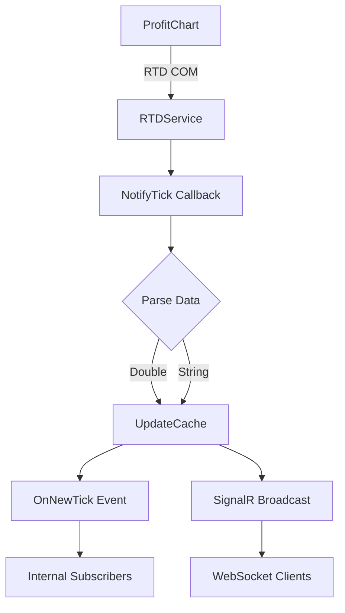

# ProfitChart Integration Services

Este diretório contém os serviços de integração com a plataforma **ProfitChart** via **RTD (Real-Time Data)**.

## 📁 Arquivos

### `IRtdService.cs`
Interface do serviço de integração RTD com todos os contratos e DTOs.

**Principais métodos:**
- `InitializeAsync()` - Inicializa conexão RTD
- `GetStatistics()` - Estatísticas de comunicação
- `GetAllTickersStatus()` - Status de todos tickers
- `GetLastValue()` - Último valor de um tópico
- `GetTickerSnapshot()` - Snapshot completo de ticker

**DTOs:**
- `RtdTickerConfig` - Configuração de ticker
- `RtdStatistics` - Estatísticas do serviço
- `TickerStatus` - Status individual de ticker

### `RTDService.cs`
Implementação principal do integrador ProfitChart.

**Responsabilidades:**
1. ✅ Conectar ao servidor RTD do ProfitChart
2. ✅ Receber dados em tempo real via callbacks
3. ✅ Armazenar em cache (último valor por ticker/topic)
4. ✅ Distribuir via eventos C# (`OnNewTick`)
5. ✅ Distribuir via SignalR (broadcasting assíncrono)
6. ✅ Fornecer consultas instantâneas do cache
7. ✅ Monitorar saúde da conexão
8. ✅ Reconectar automaticamente tópicos sem dados

**Fluxo de dados:**
```
ProfitChart (RTD)
    ↓
RTDService.NotifyTick()
    ├→ UpdateLastValue() → Cache
    ├→ OnNewTick?.Invoke() → Event subscribers
    └→ ProfitChartHub.BroadcastTickData() → WebSocket clients
```

## 🔧 Configuração

### rtd_config.json
```json
{
  "WIN": {
    "TICK": "WINJ25",
    "TICKERS": ["WINJ25", "WINFUT_F_0"],
    "BASE": 1,
    "N_CONTRATO": 5,
    "Description": "Mini Índice Bovespa",
    "AssetType": "FUTURE",
    "IsActive": true
  }
}
```

**Campos:**
- `TICK` - Ticker principal
- `TICKERS` - Lista de tickers alternativos
- `BASE` - Multiplicador de pontos (1 para índice, 5 para dólar)
- `N_CONTRATO` - Número máximo de contratos
- `Description` - Descrição do ativo
- `AssetType` - Tipo (FUTURE, STOCK, FOREX, CRYPTO, OPTION)
- `IsActive` - Se está ativo para conexão

## 📡 Tópicos RTD

### Conectados Automaticamente (60 por ticker)

**Preços:**
- `ULT` - Último preço
- `PRT` - Preço abertura
- `MAX`, `MIN` - Máxima/Mínima
- `FEC`, `FEA` - Fechamentos
- `ABE` - Abertura
- `OCP`, `OVD` - Ofertas compra/venda

**Volumes:**
- `VOL` - Volume total
- `VOC`, `VOV` - Volumes compra/venda

**Book (DOM):**
- `QC`, `QV` - Quantidades totais
- `QC1-QC20` - Níveis de compra
- `QV1-QV20` - Níveis de venda

**Outros:**
- `EST` - Estado do mercado
- `AJA`, `AJU` - Ajustes
- `HORA` - Horário
- `VWA` - VWAP

## 🏗️ Arquitetura

### Dependências

```csharp
// Interop COM com ProfitChart
using RTDTrading;  // Interop.RTDTrading.dll (em Libs/)

// Integration
using Microsoft.AspNetCore.SignalR;
using NtBot.Api.Hubs;
```

### Registro no DI Container

```csharp
// Program.cs
builder.Services.AddSingleton<IRtdService, RtdService>();

// Inicialização automática
var rtdService = scope.ServiceProvider.GetRequiredService<IRtdService>();
await rtdService.InitializeAsync("rtd_config.json");
```

### Ciclo de Vida

1. **Startup:**
   - `ServerStart()` → Inicia servidor RTD
   - `ConnectData()` → Conecta tópicos configurados
   - Inicia timers de reconexão e diagnóstico

2. **Runtime:**
   - `NotifyTick()` → Callback do RTD quando há dados
   - `RefreshData()` → Obtém dados do RTD
   - Parse e distribuição multi-canal

3. **Monitoramento:**
   - Timer de reconexão (10s) → Tenta reconectar tópicos sem dados
   - Timer de diagnóstico (15s) → Verifica saúde da comunicação
   - Tracking de última recepção

## 🔄 Fluxo Completo



## 📊 Estatísticas

O serviço rastreia:

- ✅ Total de dados recebidos
- ✅ Última recepção (timestamp)
- ✅ Tópicos conectados vs com dados
- ✅ Taxa de dados por segundo
- ✅ Status de conexão (últimos 30s)
- ✅ Tempo de uptime

Acesse via:
```csharp
var stats = _rtdService.GetStatistics();
// ou via API
GET /api/profitchart/statistics
```

## 🔍 Diagnóstico

### Logs Importantes

```
[RTD INIT] Iniciando servidor RTD
[RTD CONNECT] ✓ id=1000 ticker=WINJ25 topic=ULT
[RTD DATA] ✓✓✓ DADO RECEBIDO #1: WINJ25.ULT = 127850
[RTD DIAGNOSTIC] ✓ Comunicação OK - 1547 dados recebidos
```

### Alertas

```
⚠️⚠️⚠️ [RTD DIAGNOSTIC] ALERTA ⚠️⚠️⚠️
[RTD DIAGNOSTIC] NENHUM DADO RECEBIDO desde a inicialização!
```

**Soluções:**
1. Verificar se ProfitChart está aberto
2. Verificar "M" verde no ProfitChart
3. Habilitar RTD: Ferramentas → Configurações → RTD
4. Verificar tickers no config

## 🎯 Casos de Uso

### 1. Consulta Pontual (REST API)
```csharp
var price = await _rtdService.GetLastValue("WINJ25", "ULT");
// Retorna do cache - instantâneo
```

### 2. Streaming (SignalR)
```csharp
// Clientes recebem automaticamente
// quando dados chegam via NotifyTick()
```

### 3. Event-Driven (C#)
```csharp
_rtdService.OnNewTick += (ticker, topic, value) =>
{
    Console.WriteLine($"{ticker}.{topic} = {value}");
};
```

## 🔒 Thread Safety

- ✅ Cache de valores usa `lock (_lastValuesLock)`
- ✅ Broadcast SignalR é assíncrono (`_ = Task.Run()`)
- ✅ Não bloqueia callback do RTD

## 📚 Referências

- **Documentação Completa:** `/PROFITCHART_INTEGRATOR.md`
- **Guia Rápido:** `/QUICK_TEST_PROFITCHART.md`
- **Exemplos:** `src/NtBot.Api/Examples/ProfitChartExamples.cs`
- **Controller:** `src/NtBot.Api/Controllers/ProfitChartController.cs`
- **Hub:** `src/NtBot.Api/Hubs/ProfitChartHub.cs`

## ⚡ Performance

- **Latência:** < 10ms do RTD ao cache
- **Broadcasting:** Não bloqueia RTD (fire-and-forget)
- **Queries:** Instantâneas (cache em memória)
- **Capacidade:** Testado com 10+ tickers, 600+ tópicos simultâneos

## 🛠️ Manutenção

### Adicionar Novo Tópico

Adicione em `TopicosFixos`:
```csharp
private static readonly List<string> TopicosFixos = new() {
    "ULT", "VOL", "NOVO_TOPICO", ...
};
```

### Adicionar Novo Ticker

Edite `rtd_config.json`:
```json
{
  "NOVO": {
    "TICK": "TICKER",
    "BASE": 1,
    "N_CONTRATO": 1,
    "IsActive": true
  }
}
```

Reinicie o serviço ou implemente reload dinâmico.

---

**Integrador ProfitChart - Parte do NTBot Trading System**
